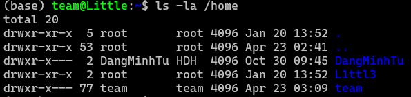

## Introduction

Linux là một hệ điều hành mã nguồn mở, miễn phí, dựa trên nền tảng Unix. Nó hoạt động như trung gian giữa phần cứng và phần mềm, nổi tiếng với tính bảo mật, ổn định và linh hoạt cao.

Linux bản chất là kernel là lớp phần mềm trung gian quản lý phần cứng (CPU, RAM, Disk) và cho phép các ứng dụng chạy trên đó. Khi kết hợp Linux kernel với các công cụ hệ thống (thường từ dự án GNU), trình quản lý cửa sổ (GNOME, KDE) và kho ứng dụng, chúng ta có một **Distro** (bản phân phối) hoàn chỉnh. Một số **Linux Distro** phổ biến: Ubuntu, Fedora, Debian, Arch,...

Trong bài viết này mình sẽ đề cập đến **Ubuntu** vì nó là bản phân phối được sử dụng rộng rãi, dễ tiếp cận và dễ dùng với mọi người. **Ubuntu** là một bản phân phối dựa trên **Debian**, nó kế thừa phần lớn mô hình quản lý gói và cách tiếp cận đóng gói phần mềm từ **Debian**. **Ubuntu** sử dụng định dạng gói `.deb` và trình quản lý gói `apt` để installing, updating, và removing software. Điều này cho phép người dùng truy cập và một hệ sinh thái phần mềm rất lớn và quy trình làm việc với CLI quen thuộc.

## Command Line

`Shell` là một chương trình đặc biệt đóng vai trò giao diện trung gian giữa user và kernel. Nó nhận các lệnh dạng văn bản từ CLI hoặc file script, phiên dịch chúng thành ngôn ngữ máy để kernel thực thi, giúp quản lý tệp tin, tiến trình và tự động hóa tác vụ.

`Bash` là một dạng `default shell` của hầu hết các **Linux distributions** (phổ biến nhất). Trong thế giới **Linux** còn có nhiều loại shell khác như `zsh`, `ksh`, `tsch`,...

Dưới đây sẽ là những lệnh `Bash` cơ bản:
- `pwd`: trả về đường dẫn đầy đủ của thư mục hiện tại.
- `cd`: di chuyển từ thư mục này sang thư mục khác.
- `ls`: liệt kê danh sách các tệp tin và thư mục con có trong thư mục hiện hành.
- `touch`: tạo một tệp tin trống mới hoặc cập nhật thời gian chỉnh sửa của một tệp có sẵn.
- `file`: xác định định dạng thực sử của một tệp tin (bất kể phần mở rộng là gì).
- `cat`: đọc và hiển thị nội dung file.
- `less`: cho phép đọc nội dung file theo từng trang.
- `history`: liệt kê danh sách các câu lệnh đã từng gõ trước đó.
- `cp`: sao chép file hoặc directory.
- `mv`: di chuyển file hoặc đổi tên tệp.
- `mkdir`: tạo thư mục mới.
- `rm`: xóa tệp tin hoặc directory.
- `find`: tìm kiếm file hoặc directory dựa trên tên, kích thước, thời gian,...
- `help`: cung cấp hướng dẫn sử dụng nhanh cho các lệnh được tích hợp trong shell.
- `whatis`: giải thích ngắn gọn về công dụng cốt lõi của một câu lệnh cụ thể.
- `alias`: cho phép tự tạo **biệt danh** cho câu lệnh dài hoặc phức tạp để gõ nhanh hơn trong tương lai.

Còn rất nhiều câu lệnh nâng cao hơn các bạn có thể tìm kiếm trên Internet.

## User Management

### Users and Groups

Mỗi các nhân (User) hoặc dịch vụ truy cập vào Linux sẽ được cấp một tài khoản định danh duy nhất. Có 3 loại chính:
- **Root User**: Người quản trị tối cao, có toàn quyền trên toàn bộ hệ thống.
- **System Users**: Các tài khoản dành riêng cho các dịch vụ (như gvm, mysql, apache) chạy ngầm.
- **Regular Users**: Tài khoản của người dùng bình thường, bị giới hạn quyền hạn để bảo vệ hệ thống.

**Group** là một tập hợp các user được gom lại để quản lý chung một bộ quyền hạn. Thay vì cấp quyền cho từng user, ta chỉ cần cấp quyền cho nhóm đó.

Mỗi người dùng trong Linux sẽ được gán một **personal directory** trong thư mục **home**, thường có định dạng là `/home/username`.

Hệ thống sử dụng **User ID (uid)** và **Group ID (gid)** để định danh một người dùng. Hệ điều hành sẽ dựa vào **uid** để phân quyền của người dùng đối với mỗi file.



Trong hệ thống phân cấp User và Groups, `root` là một superuser đứng trên mọi user khác. `root` có khả năng truy cập bất kì file nào và quản lý bất kỳ quy trình nào. Nhưng nếu hoạt động với quyền `root` rất rủi ro, một sai lầm ngớ ngẩn có thể làm bay màu cả hệ thống.

Để giảm thiểu rủi ro này, lệnh `sudo` được sinh ra để các user có thể mượn quyền `root` để làm việc.

Ta sẽ test thử xem file `/etc/shadow` (nơi lưu encrypted password của các users):

```bash
cat /etc/shadow
```

Ta sẽ nhận được một lỗi "Permission denied". Xem thử quyền của file là gì:

```bash
$ ls -la /etc/shadow

-rw-r----- 1 root shadow 1134 Dec 1 11:45 /etc/shadow
```

Output chỉ ra rằng chỉ có `root` và các thành viên của nhóm `shadow` mới có thể đọc được file này. Giờ ta sẽ chạy lại với lệnh `sudo`:

```bash
sudo cat /etc/shadow
```

Sau đó nhập password của user hiện tại vào thì lệnh sẽ được thực thi.

Ngoài lệnh `sudo`, ta có thể sử dụng `su` để leo lên quyền `root`. Khi sử dụng lệnh `su` mà không có thên username nào, `su` sẽ mở một sessiong shell mới với quyền `root` và sẽ hỏi ta về password của `root` để login.

```bash
su
```

Ta có thể sử dụng `su username` để chuyển sang các user khác với điều kiện phải biết password của user đó.

### /etc/passwd

Trong Linux, `username` là tên dễ đọc dành cho con người, còn hệ thống sẽ dùng một con số định danh duy nhất gọi là **UID** (**User ID**) để nhận diện user. Mối liên hệ giữa `username` và `UID` được lưu trong file `/etc/passwd`, đây là một trong những file quan trọng nhất khi quản lý tài khoản trên Linux.

Ta có thể xem nội dung của file này bằng lệnh:

```bash
cat /etc/passwd
```

File này chứa danh sách tất cả user có trên hệ thống, và mỗi dòng sẽ đại diện cho một tài khoản.

#### Phân tích các trường trong `/etc/passwd`

Một dòng rất điển hình trong file này, thường là dòng của `root`, sẽ có dạng:

```text
root:x:0:0:root:/root:/bin/bash
```

Dòng này gồm **7 trường** được phân tách bằng dấu `:`:

1. **Username**: Tên đăng nhập của user, ví dụ `root`.
2. **Password placeholder**: Trường này không còn lưu trực tiếp encrypted password như trước.
   - `x` nghĩa là mật khẩu đã mã hóa được lưu trong file `/etc/shadow`.
   - `*` nghĩa là tài khoản đang bị khóa và không thể dùng để đăng nhập.
   - Nếu để trống, tài khoản đó không có password.
3. **UID** (**User ID**): Mã định danh số của user. Riêng `root` luôn có `UID = 0`.
4. **GID** (**Group ID**): Mã định danh của group chính mà user đó thuộc về.
5. **GECOS**: Trường mô tả thêm thông tin về user như tên đầy đủ, số điện thoại hoặc vị trí làm việc. Các thông tin này thường được ngăn cách bằng dấu phẩy.
6. **Home Directory**: Đường dẫn tuyệt đối đến thư mục cá nhân của user, ví dụ `/root`.
7. **Login Shell**: Shell mặc định sẽ được chạy khi user đăng nhập, ví dụ `/bin/bash`.

#### System Users và các tài khoản đặc biệt

Khi mở `/etc/passwd`, ta sẽ thấy không chỉ có tài khoản của người dùng thật mà còn có rất nhiều tài khoản phục vụ cho hệ thống. Đây là các **system users**, được tạo ra để chạy những service hoặc process cụ thể với quyền hạn giới hạn hơn, từ đó giúp tăng tính an toàn cho hệ thống. Ví dụ, user `daemon` thường được dùng để chạy các tiến trình nền.

#### Có nên chỉnh sửa trực tiếp `/etc/passwd` không?

Về mặt kỹ thuật, ta vẫn có thể sửa trực tiếp file `/etc/passwd` bằng text editor hoặc công cụ như `vipw`. Tuy nhiên, điều này **không được khuyến khích** vì chỉ cần sai một dấu `:` hoặc làm hỏng cấu trúc file là có thể khiến hệ thống gặp lỗi, thậm chí làm user không đăng nhập được.

An toàn hơn là sử dụng các công cụ chuyên dụng như:
- `useradd`: tạo user mới.
- `usermod`: chỉnh sửa thông tin user đã có.
- `userdel`: xóa user khỏi hệ thống.

Những công cụ này sẽ cập nhật `/etc/passwd` đúng cách và đồng thời xử lý các cấu hình liên quan khác.

### /etc/shadow

File `/etc/shadow` là một thành phần rất quan trọng trong Linux vì nó lưu các thông tin xác thực nhạy cảm của user. Khác với `/etc/passwd` có thể được đọc công khai, `/etc/shadow` chỉ cho phép truy cập bằng quyền `root` hoặc `sudo`, nhờ đó password của user được bảo vệ tốt hơn.

#### Vai trò của file `/etc/shadow` trong Linux

Mục đích chính của `/etc/shadow` là lưu **encrypted password** và các thiết lập liên quan đến **password aging**. Việc tách phần dữ liệu nhạy cảm này ra khỏi `/etc/passwd` giúp hệ thống an toàn hơn, vì nếu user thường đọc được password hash thì họ có thể mang về và thử crack ngoại tuyến.

#### Xem file với `cat /etc/shadow`

Để xem nội dung file này, ta phải dùng lệnh với quyền cao hơn, thường là `sudo`:

```bash
$ sudo cat /etc/shadow

root:MyEPTEa$6Nonsense:15000:0:99999:7:::
```

Kết quả trả về là các dòng dữ liệu được phân tách bằng dấu `:`, và mỗi dòng tương ứng với một user.

#### Cấu trúc của file

Mỗi dòng trong `/etc/shadow` có **9 trường**:

1. **Username**: Tên đăng nhập của user.
2. **Encrypted Password**: Mật khẩu đã được băm. Nếu trường này là `*` hoặc `!` thì tài khoản đang bị khóa.
3. **Date of Last Password Change**: Số ngày tính từ `1970-01-01` đến lần đổi mật khẩu gần nhất. Nếu giá trị là `0` thì user phải đổi mật khẩu ở lần đăng nhập tiếp theo.
4. **Minimum Password Age**: Số ngày tối thiểu phải chờ trước khi được đổi mật khẩu lần nữa.
5. **Maximum Password Age**: Số ngày tối đa mà mật khẩu còn hiệu lực. Sau thời gian này, user phải đổi mật khẩu.
6. **Password Warning Period**: Số ngày hệ thống cảnh báo trước khi mật khẩu hết hạn.
7. **Password Inactivity Period**: Số ngày sau khi mật khẩu hết hạn mà tài khoản sẽ bị vô hiệu hóa.
8. **Account Expiration Date**: Ngày tài khoản hết hạn, lưu dưới dạng số ngày kể từ `1970-01-01`.
9. **Reserved Field**: Trường dự phòng cho tương lai.

Mặc dù `/etc/shadow` là file nền tảng trong cơ chế xác thực của Linux, các bản phân phối hiện đại thường còn kết hợp thêm những cơ chế khác như **PAM** (**Pluggable Authentication Modules**) để cung cấp các chính sách xác thực linh hoạt hơn.

### /etc/group

Trong Linux, việc quản lý quyền cho nhiều user sẽ gọn hơn rất nhiều nếu dùng **group**. File trung tâm phục vụ việc này là `/etc/group`, nơi định nghĩa các group có trong hệ thống và danh sách thành viên của từng group.

#### `/etc/group` là gì?

`/etc/group` là một file văn bản thuần chứa danh sách tất cả các group trên hệ thống. Mỗi group có thể được gán quyền riêng trên file hoặc directory, từ đó giúp quản trị viên quản lý quyền truy cập hiệu quả hơn thay vì cấp quyền riêng lẻ cho từng user.

#### Xem thông tin group

Ta có thể xem nội dung file này bằng lệnh:

```bash
$ cat /etc/group

root:*:0:pete
```

#### Cấu trúc của file `/etc/group`

Tương tự `/etc/passwd`, mỗi dòng trong `/etc/group` đại diện cho một group và gồm **4 trường** được phân tách bằng dấu `:`:

1. **Group Name**: Tên duy nhất của group.
2. **Group Password**: Đây là một cơ chế cũ và ngày nay hiếm khi được dùng. Trên hệ thống hiện đại, ta thường thấy `*` hoặc `x` thay vì mật khẩu thật.
3. **Group ID (GID)**: Mã định danh số duy nhất của group. Hệ điều hành thường dùng `GID` nội bộ thay vì tên group.
4. **List of Users**: Danh sách username là thành viên của group, được ngăn cách bằng dấu phẩy.

Với ví dụ `root:*:0:pete`, ta có thể hiểu rằng tên group là `root`, group này không dùng password, `GID` của nó là `0`, và `pete` là thành viên của group đó.

## Permissions

### File Permissions

Trong Linux, gần như mọi thứ đều được biểu diễn dưới dạng file, nên việc kiểm soát ai được đọc, sửa hoặc thực thi file là một phần rất quan trọng của bảo mật hệ thống. Muốn quản trị Linux tốt, ta cần đọc được các quyền truy cập này ngay từ output của lệnh `ls -l`.

#### Xem quyền với `ls -l`

Khi liệt kê file hoặc directory ở dạng chi tiết, ta sẽ thấy một chuỗi ký tự mô tả loại file và quyền truy cập của nó:

```bash
$ ls -l Desktop/

drwxr-xr-x 2 pete penguins 4096 Dec 1 11:45 .
```

Trong toàn bộ dòng output trên, phần quan trọng nhất với chúng ta lúc này là cột đầu tiên: `drwxr-xr-x`.

#### Cách đọc chuỗi quyền truy cập

Chuỗi `drwxr-xr-x` có thể được tách ra như sau:

```text
d | rwx | r-x | r-x
```

Nó gồm **4 phần chính**:

1. **Ký tự đầu tiên** cho biết loại file.
   - `d` nghĩa là **directory**.
   - `-` nghĩa là **regular file**.
2. **Ba ký tự tiếp theo** là quyền của **user** sở hữu file.
3. **Ba ký tự tiếp theo nữa** là quyền của **group**.
4. **Ba ký tự cuối cùng** là quyền của **other**, tức mọi user còn lại trong hệ thống.

Mỗi ký tự trong các nhóm quyền có một ý nghĩa riêng:

- `r` (**read**): cho phép đọc nội dung file.
- `w` (**write**): cho phép chỉnh sửa hoặc ghi dữ liệu vào file.
- `x` (**execute**): cho phép thực thi file như một chương trình.
- `-`: không có quyền tương ứng.

Ý nghĩa của các quyền này có thể hơi khác nhau giữa file và directory. Ví dụ:
- Với **file**, quyền `x` cho phép chạy file như một chương trình hoặc script.
- Với **directory**, quyền `x` cho phép đi vào thư mục đó bằng các lệnh như `cd`.

### Modifying Permissions

Khi cần thay đổi quyền truy cập của file hoặc directory, lệnh quan trọng nhất mà ta dùng là `chmod` (**change mode**). Đây là công cụ cơ bản để thêm, bớt hoặc thiết lập lại quyền cho `user`, `group`, và `other`.

`chmod` có hai cách dùng phổ biến:
- **Symbolic mode**: dùng ký hiệu chữ cái để thêm hoặc xóa quyền.
- **Numerical mode**: dùng số để thiết lập toàn bộ quyền trong một lần.

#### Dùng Symbolic Mode

`Symbolic mode` dễ đọc hơn vì nó dùng các chữ cái để chỉ đối tượng mà ta muốn thay đổi quyền:

- `u` (**user**): chủ sở hữu file.
- `g` (**group**): group của file.
- `o` (**other**): những user còn lại.
- `a` (**all**): áp dụng cho cả `user`, `group`, và `other`.

Sau khi chỉ định đối tượng, ta dùng:
- `+` để thêm quyền.
- `-` để xóa quyền.

Ví dụ, để thêm quyền thực thi cho owner của file:

```bash
chmod u+x myfile
```

Lệnh này có thể được đọc là: thêm (`+`) quyền thực thi (`x`) cho user (`u`) trên file `myfile`.

Nếu muốn xóa quyền ghi của group:

```bash
chmod g-w myfile
```

Ta cũng có thể thay đổi nhiều quyền cùng lúc. Ví dụ sau sẽ thêm quyền ghi cho cả user và group:

```bash
chmod ug+w myfile
```

#### Dùng Numerical Mode

Ngoài ký hiệu chữ, Linux còn cho phép thay đổi quyền bằng **numerical mode** hay còn gọi là **octal mode**. Cách này dùng ba chữ số để biểu diễn quyền của `user`, `group`, và `other`.

Mỗi quyền được gán một giá trị số:

- `4`: read (`r`)
- `2`: write (`w`)
- `1`: execute (`x`)

Muốn tạo ra một bộ quyền, ta cộng các giá trị này lại với nhau. Ví dụ:
- `7 = 4 + 2 + 1` tương ứng với `rwx`
- `5 = 4 + 1` tương ứng với `r-x`
- `6 = 4 + 2` tương ứng với `rw-`

Một ví dụ rất phổ biến là:

```bash
chmod 755 myfile
```

Ta có thể tách số `755` như sau:

1. **7** cho `user`: `4 + 2 + 1` nên owner có quyền `rwx`.
2. **5** cho `group`: `4 + 1` nên group có quyền `r-x`.
3. **5** cho `other`: `4 + 1` nên các user còn lại cũng có quyền `r-x`.

Như vậy, `chmod 755 myfile` sẽ tạo ra bộ quyền:

```text
rwxr-xr-x
```

#### Lưu ý bảo mật khi đổi quyền

`chmod` rất mạnh, nhưng cũng cần dùng cẩn thận. Nếu cấp quyền quá rộng, file có thể bị đọc hoặc sửa bởi những người không nên có quyền truy cập. Một ví dụ phổ biến nhưng nguy hiểm là:

```bash
chmod -R 777 /some/directory
```

Lệnh này cấp toàn quyền đọc, ghi, và thực thi cho tất cả mọi người trên toàn bộ cây thư mục. Trong thực tế, đây thường là một cách làm thiếu an toàn. Nguyên tắc tốt nhất là chỉ cấp đúng lượng quyền cần thiết, không hơn.

## Processes

Trong Linux, **process** là một chương trình đang được thực thi. Mỗi process đều có một mã định danh riêng gọi là **PID** (**Process ID**), và kernel sẽ chịu trách nhiệm tạo, theo dõi, cấp phát tài nguyên, cũng như thu hồi tài nguyên khi process kết thúc.

### Monitor Processes với `ps`

Lệnh cơ bản nhất để quan sát process là `ps`. Khác với `top`, `ps` không hiển thị theo thời gian thực mà chỉ cho ta một **snapshot** tại đúng thời điểm lệnh được chạy.

#### Dùng `ps` cơ bản

Nếu chỉ chạy:

```bash
$ ps

PID   TTY          TIME CMD
41230 pts/4    00:00:00 bash
51224 pts/4    00:00:00 ps
```

Ta sẽ thấy các process gắn với terminal hiện tại. Những cột quan trọng nhất gồm:

- `PID`: mã định danh duy nhất của process.
- `TTY`: terminal điều khiển process đó.
- `TIME`: tổng thời gian CPU mà process đã sử dụng.
- `CMD`: câu lệnh dùng để khởi chạy process.

Trên nhiều hệ thống, output còn có thêm cột `STAT`, dùng để biểu diễn trạng thái hiện tại của process.

#### Dùng `ps aux`

Một cách dùng rất phổ biến khác là:

```bash
ps aux
```

Đây là kiểu cú pháp BSD, nghĩa là các option không có dấu `-`. Bộ option này thường được hiểu như sau:

- `a`: hiển thị process của mọi user.
- `u`: dùng định dạng chi tiết theo kiểu user-oriented.
- `x`: hiển thị cả những process không gắn với terminal nào, thường là các daemon chạy nền.

`ps aux` cho ta cái nhìn đầy đủ hơn vì ngoài `PID` và `COMMAND`, nó còn thường hiển thị thêm các cột như `USER`, `%CPU`, `%MEM`, `VSZ`, và `RSS`.

#### Dùng `ps -ef`

Một kiểu rất hay gặp khác là:

```bash
ps -ef
```

Đây là cú pháp System V. Trong đó:

- `-e`: chọn mọi process trên hệ thống.
- `-f`: hiển thị ở định dạng đầy đủ hơn.

`ps -ef` thường cung cấp thêm các trường như:

- `UID`: user sở hữu process.
- `PID`: process ID.
- `PPID`: parent process ID.
- `C`: mức sử dụng CPU.
- `STIME`: thời điểm process được khởi tạo.
- `CMD`: lệnh đầy đủ đã dùng để chạy process.

Khi cần chẩn đoán nhanh hệ thống đang chạy những gì, `ps aux` và `ps -ef` là hai lệnh được dùng thường xuyên nhất.

#### Theo dõi thời gian thực với `top`

Nếu `ps` chỉ cho ảnh chụp tức thời, thì `top` cho ta một khung nhìn động theo thời gian thực:

```bash
top
```

Lệnh này rất hữu ích khi cần tìm process nào đang ngốn CPU hoặc RAM nhiều nhất.

### Process Details

Để quản lý process tốt hơn, ta cần hiểu process thực sự là gì. Nói ngắn gọn, một process là **một instance của chương trình đang chạy**. Cùng một chương trình có thể sinh ra nhiều process khác nhau.

Ví dụ, nếu mở hai terminal rồi chạy `cat` ở cả hai nơi, sau đó dùng một terminal khác chạy:

```bash
ps aux | grep cat
```

Ta sẽ thấy hai process `cat` riêng biệt. Dù cùng xuất phát từ một chương trình, mỗi process vẫn có PID riêng, vùng nhớ riêng, và tài nguyên riêng.

#### Kernel quản lý process như thế nào?

Linux kernel là thành phần chịu trách nhiệm cho toàn bộ việc quản lý process. Khi ta chạy một chương trình, kernel sẽ:

- nạp chương trình vào bộ nhớ;
- cấp phát tài nguyên như CPU time, memory, và I/O;
- theo dõi trạng thái của process;
- ghi nhận owner của process;
- xử lý signal gửi đến process;
- sắp lịch để nhiều process cùng chia sẻ tài nguyên hệ thống.

Nói cách khác, mọi process đang chạy đều cạnh tranh tài nguyên với nhau, và kernel đóng vai trò điều phối để hệ thống hoạt động ổn định. Khi process hoàn thành công việc hoặc bị kết thúc, kernel sẽ thu hồi lại tài nguyên mà process đó đang dùng.

### Killing Processes

Trong Linux, việc kết thúc process thường được thực hiện bằng cách gửi **signal**. Lệnh quen thuộc nhất cho việc này là `kill`. Dù tên là `kill`, lệnh này không chỉ dùng để "giết" process mà thực ra dùng để gửi nhiều loại signal khác nhau.

Hai signal quan trọng nhất trong ngữ cảnh này là `SIGTERM` và `SIGKILL`:

- `SIGTERM` là tín hiệu yêu cầu process tự kết thúc một cách có kiểm soát. Process vẫn có cơ hội dọn dẹp tài nguyên, đóng file, hoặc lưu dữ liệu trước khi thoát.
- `SIGKILL` là tín hiệu buộc process phải dừng ngay lập tức. Process không thể chặn hoặc tự xử lý signal này, nên nó sẽ không có cơ hội cleanup trước khi bị kết thúc.

Vì vậy, nguyên tắc chung là nên thử `SIGTERM` trước, và chỉ dùng `SIGKILL` khi process bị treo hoặc không phản hồi.

#### Kết thúc mặc định với `SIGTERM`

Khi chạy lệnh:

```bash
kill 12445
```

Linux mặc định sẽ gửi `SIGTERM` (signal số `15`) đến process có `PID = 12445`. Đây là cách kết thúc "lịch sự", vì process có cơ hội dọn dẹp tài nguyên, lưu dữ liệu còn dang dở, rồi tự thoát.

Ta cũng có thể viết tường minh:

```bash
kill -15 12445
```

Hai lệnh trên là tương đương nhau.

#### Buộc dừng với `SIGKILL`

Nếu process bị treo hoặc không phản hồi với `SIGTERM`, ta có thể dùng:

```bash
kill -9 12445
```

`SIGKILL` (signal số `9`) sẽ buộc process dừng ngay lập tức, không cho nó cơ hội tự cleanup. Vì vậy, đây nên là lựa chọn sau cùng khi cách kết thúc thông thường không còn hiệu quả.

#### Một số signal phổ biến khác

Ngoài `SIGTERM` và `SIGKILL`, còn một vài signal rất hay gặp:

- `SIGHUP` (1): thường dùng để yêu cầu process, đặc biệt là daemon, nạp lại file cấu hình.
- `SIGINT` (2): signal ngắt, thường được gửi khi ta nhấn `Ctrl-C`.
- `SIGSTOP` (19): tạm dừng process mà không kết thúc nó.
- `SIGCONT`: tiếp tục chạy một process đã bị dừng trước đó.

#### Kiểm tra process có tồn tại không với `kill -0`

Một cách dùng khá đặc biệt của `kill` là:

```bash
kill -0 12445
```

Lệnh này không thật sự gửi signal để kết thúc process. Thay vào đó, nó giúp kiểm tra xem process với PID tương ứng có tồn tại hay không, đồng thời kiểm tra xem user hiện tại có quyền gửi signal đến process đó hay không.


## The Filesystem

Trong Linux, filesystem không chỉ là nơi lưu file mà còn là cách hệ điều hành tổ chức toàn bộ dữ liệu, thiết bị, và các điểm mount. Để làm việc tốt với Linux, ta cần hiểu cây thư mục chuẩn, cách đo dung lượng đĩa, và cách tạo các liên kết giữa file.

### Filesystem Hierarchy

Phần lớn các bản phân phối Linux sắp xếp filesystem theo một chuẩn chung gọi là **FHS** (**Filesystem Hierarchy Standard**). Nhờ đó, các file quan trọng thường nằm ở những vị trí có thể đoán trước được, giúp việc quản trị hệ thống nhất quán hơn.

Để xem các thư mục cấp cao nhất của hệ thống, ta có thể chạy:

```bash
ls -l /
```

#### Root Directory

Thư mục gốc của toàn bộ hệ thống là:

- `/`: đây là điểm bắt đầu của toàn bộ filesystem. Mọi file và directory trên máy đều nằm bên dưới thư mục này.

#### Essential System Directories

Một số thư mục hệ thống quan trọng nhất gồm:

- `/bin`: chứa các chương trình dòng lệnh thiết yếu như `ls`, `cp`, `mv`.
- `/sbin`: chứa các binary phục vụ quản trị hệ thống, thường dành cho `root`.
- `/etc`: nơi chứa các file cấu hình của hệ điều hành và ứng dụng.
- `/lib`: chứa các shared library cần thiết cho các chương trình trong `/bin` và `/sbin`.
- `/boot`: chứa những file cần cho quá trình khởi động hệ thống, bao gồm kernel và boot loader.

#### User and Application Data

Các thư mục liên quan đến dữ liệu người dùng và phần mềm gồm:

- `/home`: chứa thư mục cá nhân của từng user.
- `/root`: thư mục home riêng của user `root`.
- `/opt`: thường dùng cho các phần mềm tùy chọn hoặc phần mềm bên thứ ba.
- `/usr`: chứa phần lớn chương trình và tiện ích người dùng. Ví dụ, `/usr/bin` lưu nhiều binary thông dụng và `/usr/local` thường chứa phần mềm cài từ source.

#### Dynamic and Temporary Data

Một số thư mục có dữ liệu thay đổi thường xuyên:

- `/var`: lưu dữ liệu "biến thiên" như log, cache, spool file.
- `/tmp`: nơi chứa file tạm, thường có thể bị xóa sau khi reboot.
- `/run`: lưu runtime data của hệ thống kể từ lần boot gần nhất, ví dụ PID file.

#### Device and Mount Points

Linux cũng biểu diễn thiết bị và điểm mount dưới dạng các đường dẫn trong filesystem:

- `/dev`: chứa các device file đại diện cho phần cứng và thiết bị hệ thống.
- `/media`: điểm mount chuẩn cho USB, thẻ nhớ, CD-ROM và các thiết bị rời.
- `/mnt`: nơi thường được dùng để mount tạm thời một filesystem.

#### System Information

Ngoài dữ liệu thông thường, filesystem Linux còn có những thư mục đặc biệt cung cấp thông tin hệ thống:

- `/proc`: một virtual filesystem cung cấp thông tin về process đang chạy và tham số của kernel.
- `/srv`: dành cho dữ liệu được hệ thống cung cấp ra bên ngoài, ví dụ dữ liệu của web server.

### Disk Usage

Quản lý dung lượng đĩa là một công việc rất cơ bản khi sử dụng Linux. Hai lệnh quan trọng nhất cho việc này là `df` và `du`.

#### Kiểm tra dung lượng filesystem với `df`

Lệnh `df` (**disk free**) cho biết dung lượng đã dùng và còn trống của các filesystem đang được mount. Để xem ở dạng dễ đọc hơn như GB hoặc MB, ta dùng:

```bash
$ df -h

Filesystem      Size  Used Avail Use% Mounted on
/dev/sda1       6.2G  2.3G  3.6G  40% /
```

Output này thường cho ta biết:

- tên filesystem hoặc thiết bị;
- tổng dung lượng;
- dung lượng đã dùng;
- dung lượng còn trống;
- phần trăm đã sử dụng;
- vị trí được mount.

#### Kiểm tra inode usage với `df -i`

Ngoài block storage, filesystem còn dùng **inode** để lưu metadata của file như owner, permission, và vị trí dữ liệu. Trong một số trường hợp hiếm, hệ thống vẫn còn dung lượng trống nhưng lại hết inode. Để kiểm tra điều đó, ta dùng:

```bash
$ df -i

Filesystem      Inodes  IUsed   IFree IUse% Mounted on
/dev/sda1      4128768 128768 4000000    4% /
```

Lệnh này cho ta biết tổng số inode, số inode đã dùng, số còn trống, và tỷ lệ sử dụng inode trên từng filesystem.

#### Xem dung lượng thư mục với `du`

Nếu `df` cho ta cái nhìn tổng thể về filesystem, thì `du` (**disk usage**) giúp xác định file hoặc directory nào đang chiếm nhiều chỗ.

Ví dụ:

```bash
du -h
```

Lệnh này sẽ hiển thị dung lượng của các thư mục con trong thư mục hiện tại. Ta cũng có thể chỉ rõ một đường dẫn cụ thể, ví dụ:

```bash
du -h /home/pete
```

Nếu chạy `du -h /`, output có thể rất dài, nên trong thực tế ta thường kiểm tra các thư mục nghi ngờ là đang chiếm nhiều dung lượng.

#### `df` và `du` khác nhau thế nào?

Hai lệnh này rất dễ bị nhầm vì cú pháp khá giống nhau. Có thể nhớ đơn giản như sau:

- dùng `df` để xem filesystem còn trống bao nhiêu;
- dùng `du` để xem file hoặc directory đang chiếm bao nhiêu dung lượng.

### Symlinks

Trước khi nói về `symlink` và `hard link`, ta cần hiểu khái niệm **inode**. Trong Linux, inode là một cấu trúc dữ liệu dùng để lưu **metadata** của file, chẳng hạn như owner, group, permission, kích thước file, thời điểm tạo hoặc sửa đổi, và vị trí dữ liệu trên đĩa. Điều quan trọng là inode **không lưu tên file**; tên file thực ra chỉ là một entry trong directory trỏ tới inode tương ứng.

Điều đó có nghĩa là:

- nhiều tên file có thể cùng trỏ đến một inode;
- khi hai tên file cùng trỏ đến một inode, ta có hard link;
- dữ liệu thực sự chỉ biến mất khi không còn entry nào trỏ tới inode đó nữa.

Khi xem file bằng `ls -li`, ta sẽ thấy thêm thông tin về **inode number** và **link count**. Ví dụ:

```bash
$ ls -li

140 drwxr-xr-x 2 pete pete 6 Jan 20 20:13 Desktop
141 drwxr-xr-x 2 pete pete 6 Jan 20 20:01 Documents
```

Ở đây, cột đầu tiên là inode number, còn con số sau chuỗi quyền là **link count**. Link count cho biết có bao nhiêu hard link đang trỏ tới cùng một inode.

Trong Linux có hai loại link chính:

- **symbolic link** (**symlink** hay **soft link**)
- **hard link**

#### Symbolic Link là gì?

Nếu trong Windows có shortcut, thì trong Linux khái niệm gần giống nhất là **symbolic link**. Symlink là một file đặc biệt dùng để trỏ đến một file hoặc directory khác theo tên của nó.

Ví dụ:

```bash
echo 'myfile' > myfile
echo 'myfile2' > myfile2
echo 'myfile3' > myfile3

ln -s myfile myfilelink
ls -li
```

Kết quả có thể trông như sau:

```text
151   -rw-rw-r-- 1 pete pete 7 Jan 21 21:36 myfile
93401 -rw-rw-r-- 1 pete pete 8 Jan 21 21:36 myfile2
93402 -rw-rw-r-- 1 pete pete 8 Jan 21 21:36 myfile3
93403 lrwxrwxrwx 1 pete pete 6 Jan 21 21:39 myfilelink -> myfile
```

Ta có thể nhận ra symlink nhờ hai dấu hiệu:

- ký tự đầu tiên của permission là `l`;
- output có thêm `->` để chỉ target mà link đang trỏ tới.

Symlink có inode riêng của nó. Vì nó trỏ bằng tên đường dẫn thay vì trỏ trực tiếp tới inode của file gốc, symlink có thể băng qua nhiều filesystem khác nhau.

#### Hard Link là gì?

Loại link còn lại là **hard link**. Khác với symlink, hard link tạo thêm một entry mới trong filesystem nhưng cùng trỏ trực tiếp tới inode của file gốc.

Ví dụ:

```bash
ln myfile2 myhardlink
ls -li
```

Kết quả có thể là:

```text
151   -rw-rw-r-- 1 pete pete 7 Jan 21 21:36 myfile
93401 -rw-rw-r-- 2 pete pete 8 Jan 21 21:36 myfile2
93402 -rw-rw-r-- 1 pete pete 8 Jan 21 21:36 myfile3
93403 lrwxrwxrwx 1 pete pete 6 Jan 21 21:39 myfilelink -> myfile
93401 -rw-rw-r-- 2 pete pete 8 Jan 21 21:36 myhardlink
```

Trong ví dụ này, `myfile2` và `myhardlink` có cùng inode number `93401`, nghĩa là chúng thực chất đang tham chiếu đến cùng một dữ liệu trên đĩa. Link count cũng tăng từ `1` lên `2`.

Điều này dẫn tới một vài hệ quả quan trọng:

- sửa nội dung của `myfile2` thì `myhardlink` cũng thấy thay đổi đó;
- xóa `myfile2` thì dữ liệu vẫn còn nếu `myhardlink` vẫn tồn tại;
- dữ liệu chỉ thực sự bị xóa khi link count giảm về `0`.

Vì hard link trỏ trực tiếp tới inode, nó không thể băng qua filesystem khác.

#### Tạo symlink và hard link với `ln`

Ta dùng lệnh `ln` để tạo cả hai loại link:

- tạo symlink:

```bash
ln -s /path/to/original /path/to/link
```

- tạo hard link:

```bash
ln /path/to/original /path/to/link
```


There may be more ...