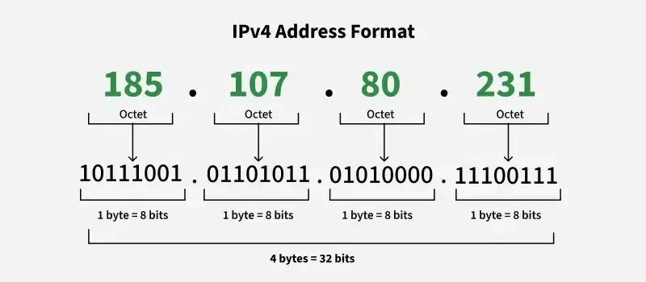
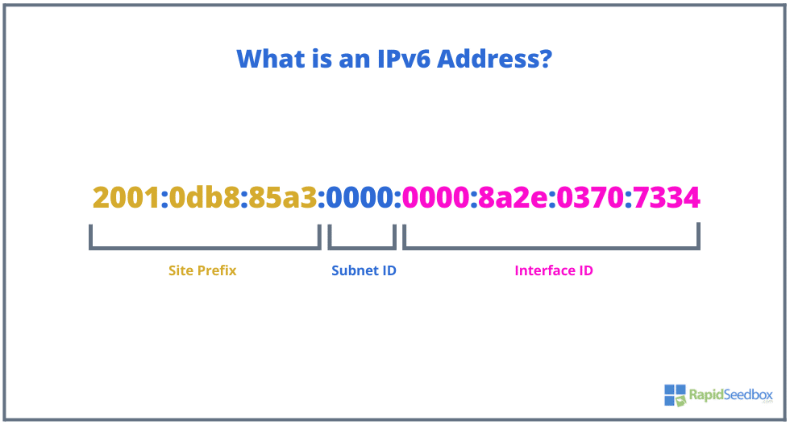
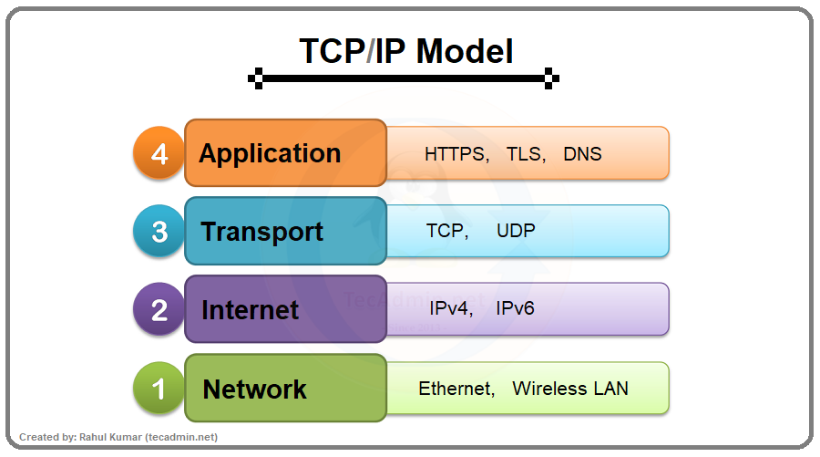
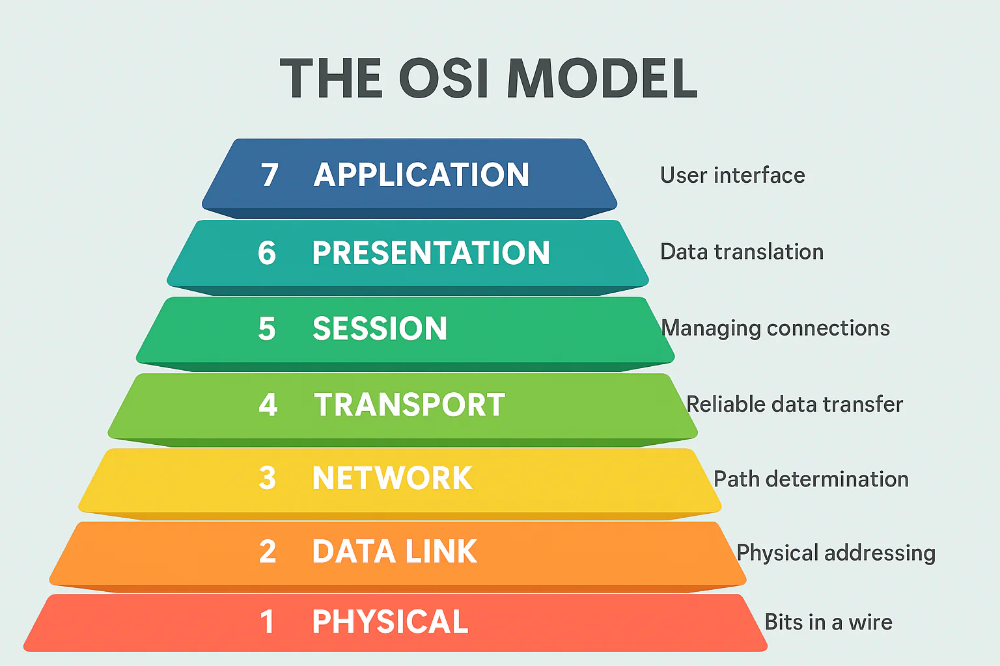
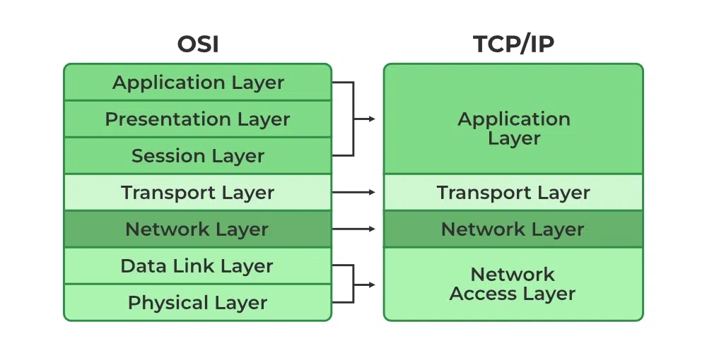

## Introduction

Networking là tập hợp các nguyên tắc, giao thức và thiết bị dùng để kết nối nhiều máy tính hoặc nhiều hệ thống lại với nhau để chúng có thể trao đổi dữ liệu. Khi bạn mở một trang web, gửi email, xem video trên YouTube hay gọi API giữa hai service, ở phía sau đều đang có rất nhiều thành phần mạng phối hợp với nhau.

Mạng máy tính hiện đại hoạt động dựa trên tư tưởng phân tầng. Thay vì để một giao thức duy nhất xử lý mọi thứ, người ta chia vấn đề thành nhiều lớp: lớp nào lo địa chỉ, lớp nào lo truyền dữ liệu, lớp nào lo ứng dụng, lớp nào lo bảo mật,... Cách chia này giúp hệ thống dễ thiết kế, dễ chuẩn hóa và dễ thay thế từng thành phần riêng lẻ.

Trong bài viết này mình sẽ đi qua những khái niệm nền tảng nhất của networking.

## Addressing

Muốn các thiết bị giao tiếp với nhau, trước hết chúng phải có cách để nhận diện nhau. Trong mạng máy tính, khái niệm định danh quan trọng nhất là **IP address**. Đây là địa chỉ logic dùng để xác định thiết bị trong một mạng IP.

### IPv4



`IPv4` là phiên bản địa chỉ IP phổ biến nhất trong nhiều năm qua. Nó dùng địa chỉ dài **32 bit**, thường được viết dưới dạng **4 octet** ở hệ thập phân và ngăn cách bằng dấu chấm, ví dụ:

```text
192.168.1.10
```

Mỗi octet có giá trị từ `0` đến `255`, vì vậy một địa chỉ IPv4 nhìn bề ngoài sẽ khá ngắn gọn và dễ đọc. Tuy nhiên, vì tổng số địa chỉ chỉ vào khoảng hơn 4 tỉ nên theo thời gian, không gian địa chỉ IPv4 đã trở nên thiếu hụt.

Địa chỉ IPv4 thường được chia thành hai phần:

- **Network portion**: xác định mạng mà host đang thuộc về.
- **Host portion**: xác định thiết bị cụ thể trong mạng đó.

Việc chia hai phần này được mô tả bằng **subnet mask**. Ví dụ:

```text
192.168.1.10/24
```

Ký hiệu `/24` nghĩa là có `24 bit` đầu dành cho phần network, còn `8 bit` cuối dành cho host. Với mạng `/24`, ta thường thấy dải như `192.168.1.0/24`, trong đó:

- `192.168.1.0` là địa chỉ mạng;
- `192.168.1.255` thường là broadcast address;
- các địa chỉ ở giữa như `192.168.1.10`, `192.168.1.20` có thể gán cho host.

Trong IPv4, người ta cũng hay chia địa chỉ thành **private IP** và **public IP**:

- **Private IP** là địa chỉ dùng trong mạng nội bộ như mạng gia đình, văn phòng, VPC nội bộ trong cloud. Các dải private rất hay gặp là:
  - `10.0.0.0/8`
  - `172.16.0.0/12`
  - `192.168.0.0/16`
- **Public IP** là địa chỉ có thể được định tuyến trên Internet công cộng. Thường ISP, cloud provider hoặc datacenter sẽ cấp các địa chỉ này cho router, server hoặc load balancer.

Điểm quan trọng là:

- private IP có thể lặp lại ở nhiều mạng khác nhau, ví dụ nhà bạn và công ty đều có thể cùng dùng `192.168.1.10`;
- public IP phải là địa chỉ duy nhất ở phạm vi Internet tại thời điểm được sử dụng;
- private IP không đi thẳng ra Internet công cộng được.

Vì vậy, trong nhiều hệ thống IPv4, ta phải dùng **NAT** (**Network Address Translation**) để nhiều máy private có thể đi ra ngoài qua một hoặc vài public IP.

Ví dụ rất quen thuộc ở nhà:

- laptop có địa chỉ `192.168.1.10` trong mạng LAN;
- router Wi-Fi có địa chỉ public do ISP cấp, ví dụ `113.x.x.x`;
- khi laptop truy cập web, router sẽ NAT traffic từ private IP sang public IP trước khi gửi ra Internet.

Ngoài ra còn một vài địa chỉ đặc biệt đáng nhớ:

- `127.0.0.1`: loopback address, tức chính máy hiện tại.
- `0.0.0.0`: thường mang ý nghĩa "mọi địa chỉ" hoặc "chưa có địa chỉ".

### IPv6



`IPv6` được sinh ra để giải quyết bài toán cạn kiệt địa chỉ của IPv4. Nó dùng địa chỉ dài **128 bit**, thường được viết dưới dạng **8 nhóm hexadecimal** và ngăn cách bằng dấu `:`:

```text
2001:0db8:85a3:0000:0000:8a2e:0370:7334
```

IPv6 hỗ trợ viết gọn địa chỉ. Ví dụ, chuỗi số `0` liên tiếp có thể được rút gọn bằng `::`, nên địa chỉ trên có thể viết ngắn hơn thành:

```text
2001:db8:85a3::8a2e:370:7334
```

Không gian địa chỉ của IPv6 lớn hơn IPv4 rất rất nhiều, nên về mặt thực tế gần như không lo thiếu địa chỉ nữa. Nhờ đó, IPv6 khuyến khích mô hình **end-to-end addressing** tốt hơn và giảm sự phụ thuộc vào NAT.

Một vài điểm đáng chú ý của IPv6:

- không dùng broadcast như IPv4, thay vào đó dùng multicast và anycast;
- dùng **NDP** (**Neighbor Discovery Protocol**) thay cho `ARP`;
- hỗ trợ **SLAAC** để host có thể tự cấu hình địa chỉ trong nhiều trường hợp;
- header của IPv6 được thiết kế gọn hơn và nhất quán hơn cho việc xử lý.

Với IPv6, cách nói **private/public IP** vẫn có thể dùng để dễ hình dung, nhưng chính xác hơn thì nên nghĩ theo các loại địa chỉ sau:

- **Global unicast**: gần tương đương với "public IPv6". Đây là các địa chỉ có thể định tuyến trên Internet, thường nằm trong dải `2000::/3`.
- **Unique local address (ULA)**: gần tương đương với "private IPv6". Dải này là `fc00::/7`, trong thực tế hay gặp dạng bắt đầu bằng `fd`, ví dụ `fd12:3456:789a::1`. ULA dùng trong mạng nội bộ và không được định tuyến ra Internet công cộng.
- **Link-local address**: dải `fe80::/10`, chỉ dùng trong cùng một segment mạng. Hầu như mọi interface IPv6 đều tự có địa chỉ kiểu này để giao tiếp cục bộ, ví dụ cho NDP.

Khác với IPv4, IPv6 không đặt NAT làm cơ chế mặc định cho việc truy cập Internet. Một host IPv6 có thể vừa có:

- một địa chỉ link-local để nói chuyện trong local link;
- một địa chỉ ULA cho mạng nội bộ;
- một địa chỉ global unicast để giao tiếp end-to-end trên Internet.

Nói ngắn gọn:

- nếu muốn hình dung nhanh thì `global unicast ~= public IPv6`;
- `ULA ~= private IPv6`;
- nhưng cách gọi theo chuẩn vẫn là global unicast, unique local, link-local.

Địa chỉ loopback trong IPv6 là:

```text
::1
```

### So sánh nhanh IPv4 và IPv6

| Đặc điểm | IPv4 | IPv6 |
| --- | --- | --- |
| Độ dài địa chỉ | 32 bit | 128 bit |
| Cách viết | 4 octet thập phân | 8 nhóm hexadecimal |
| Broadcast | Có | Không dùng broadcast truyền thống |
| Cấu hình tự động | Có nhưng hạn chế | Tốt hơn với SLAAC |
| Không gian địa chỉ | Hữu hạn, thiếu hụt | Rất lớn |
| NAT | Rất phổ biến | Không bắt buộc |

## Network Devices

Một mạng máy tính không chỉ có địa chỉ IP mà còn cần các thiết bị trung gian để kết nối, tách mạng, định tuyến, và phân phối lưu lượng. Những thiết bị phổ biến nhất mà ta thường gặp là hub, switch, router và access point.

### Hub

`Hub` là một thiết bị khá cũ, hoạt động gần giống như một bộ chia tín hiệu ở **Layer 1**. Khi nhận tín hiệu từ một cổng, nó sẽ phát lại tín hiệu đó ra tất cả các cổng còn lại mà không hề "hiểu" nội dung của frame.

Điều này dẫn đến một vài hệ quả:

- hub không học địa chỉ MAC;
- hub không biết frame thực sự dành cho máy nào;
- tất cả host nối vào hub chia sẻ cùng một collision domain.

Ngày nay hub hầu như không còn được dùng trong hệ thống hiện đại vì hiệu quả quá thấp và thiếu an toàn.

### Switch

`Switch` là thiết bị cực kỳ phổ biến trong mạng LAN và chủ yếu hoạt động ở **Layer 2**. Khác với hub, switch học **MAC address** của các thiết bị cắm vào từng cổng và dùng bảng MAC đó để chuyển frame đúng nơi cần đến.

Nói đơn giản:

- hub phát frame ra mọi cổng;
- switch cố gắng chỉ gửi frame ra đúng cổng của đích.

Nhờ vậy, switch giúp giảm va chạm, tăng hiệu suất và làm mạng LAN hoạt động gọn hơn nhiều. Ngoài ra, switch quản lý còn hỗ trợ các tính năng như:

- `VLAN`;
- `trunk/access port`;
- `port security`;
- `spanning tree`;
- đôi khi có thể làm một phần chức năng Layer 3.

### Router

`Router` là thiết bị dùng để kết nối **nhiều mạng IP khác nhau** với nhau. Nó hoạt động chủ yếu ở **Layer 3**, tức là dựa vào **IP address** để quyết định gói tin nên đi tiếp theo hướng nào.

Router thường có các nhiệm vụ:

- giữ bảng định tuyến (**routing table**);
- chọn **next hop** tốt nhất cho gói tin;
- làm default gateway cho host trong LAN;
- thực hiện NAT trong nhiều mạng IPv4;
- đôi khi tích hợp luôn firewall, DHCP, VPN,...

Nếu switch giúp các thiết bị trong cùng một LAN nói chuyện với nhau, thì router giúp các mạng khác nhau nói chuyện với nhau.

### Access Point

`Access Point` hay `AP` là thiết bị cho phép các client không dây như laptop, điện thoại, tablet tham gia vào mạng LAN qua Wi-Fi. Có thể xem nó như một cầu nối giữa mạng có dây và mạng không dây.

AP thường xử lý các việc như:

- phát **SSID**;
- quản lý cơ chế bảo mật như `WPA2`, `WPA3`;
- bridge traffic từ Wi-Fi sang Ethernet.

Trong gia đình, rất nhiều thiết bị "router Wi-Fi" thực chất là một hộp tích hợp nhiều vai trò cùng lúc: router + switch + access point + đôi khi cả firewall và DHCP server.

### Phân biệt nhanh các thiết bị

| Thiết bị | Tầng thường gặp | Dựa vào thông tin gì để xử lý | Vai trò chính |
| --- | --- | --- | --- |
| Hub | Layer 1 | Tín hiệu điện/quang | Phát lại tín hiệu ra mọi cổng |
| Switch | Layer 2 | MAC address | Chuyển frame trong LAN |
| Router | Layer 3 | IP address | Kết nối nhiều mạng IP |
| Access Point | Layer 2 | MAC/Wi-Fi association | Kết nối client không dây vào LAN |

## Network Models

Để mô tả networking có hệ thống, người ta thường dùng hai mô hình nổi tiếng nhất là **OSI** và **TCP/IP**. OSI thiên về mặt lý thuyết và mô tả, còn TCP/IP gần hơn với cách Internet vận hành trong thực tế.

### TCP/IP Model

Mô hình `TCP/IP` thường được chia thành 4 tầng:



#### Vai trò, giao thức và loại dữ liệu ở từng tầng TCP/IP

| Tầng TCP/IP | Vai trò chính | Ví dụ giao thức hoặc công nghệ | Loại dữ liệu |
| --- | --- | --- | --- |
| Application | Cung cấp dịch vụ trực tiếp cho ứng dụng | HTTP, HTTPS, DNS, SMTP, SSH, DHCP | **Data** |
| Transport | Giao tiếp đầu cuối, port, reliability | TCP, UDP | **Segment** với TCP, **Datagram** với UDP |
| Internet | Định địa chỉ logic và định tuyến | IPv4, IPv6, ICMP | **Packet** |
| Network Access | Đóng gói frame và truyền xuống môi trường vật lý | Ethernet, Wi-Fi, ARP, 802.1Q | **Frame** ở lớp liên kết, **Bits** khi truyền vật lý |

#### Application Layer

Đây là tầng gần người dùng nhất. Nó chứa các giao thức mà ứng dụng sử dụng trực tiếp để trao đổi dữ liệu. Một vài ví dụ rất quen thuộc:

- `HTTP`, `HTTPS`: web;
- `DNS`: phân giải tên miền;
- `SMTP`, `IMAP`, `POP3`: email;
- `SSH`: remote shell;
- `DHCP`: cấp phát IP động.

#### Transport Layer

Tầng này chịu trách nhiệm cho việc giao tiếp đầu cuối giữa tiến trình ở hai host với nhau. Hai giao thức nổi tiếng nhất là:

- `TCP`: đáng tin cậy, có kiểm soát luồng, có thứ tự, có retransmission;
- `UDP`: đơn giản hơn, không đảm bảo giao hàng, ít overhead hơn.

Tầng transport cũng là nơi có khái niệm **port**, ví dụ:

- `80` cho HTTP;
- `443` cho HTTPS;
- `53` cho DNS.

#### Internet Layer

Đây là tầng chịu trách nhiệm định địa chỉ logic và định tuyến giữa các mạng. Những giao thức quan trọng ở tầng này gồm:

- `IPv4`
- `IPv6`
- `ICMP`

Tầng Internet lo việc gói tin mang source IP, destination IP, TTL/hop limit và đi từ mạng này sang mạng khác thông qua router.

#### Network Access Layer

Tầng này gần phần cứng nhất trong mô hình TCP/IP. Nó bao gồm cả những gì OSI tách thành Data Link và Physical. Các công nghệ tiêu biểu ở đây là:

- `Ethernet`
- `Wi-Fi (802.11)`
- `ARP`
- `802.1Q VLAN tagging`

Ở tầng này, dữ liệu được đóng gói thành **frame** và truyền đi dưới dạng tín hiệu vật lý hoặc sóng vô tuyến.

### OSI Model

Mô hình `OSI` chia networking thành **7 tầng**:



Trong thực tế, nhiều hệ thống không tách rõ Session và Presentation thành thành phần riêng biệt như sách giáo khoa, nhưng mô hình OSI vẫn rất hữu ích để phân tích vấn đề.

Vai trò và giao thức ở từng tầng OSI:

| Tầng OSI | Vai trò chính | Ví dụ giao thức hoặc công nghệ | Loại dữ liệu |
| --- | --- | --- | --- |
| 7. Application | Cung cấp dịch vụ trực tiếp cho ứng dụng | HTTP, DNS, SMTP, SSH, DHCP | **Data** |
| 6. Presentation | Biểu diễn dữ liệu, mã hóa, nén | TLS, UTF-8, JPEG, JSON | **Data** |
| 5. Session | Quản lý phiên làm việc | RPC, NetBIOS session, thiết lập và duy trì session | **Data** |
| 4. Transport | Kết nối đầu cuối, port, reliability | TCP, UDP | **Segment** với TCP, **Datagram** với UDP |
| 3. Network | Định địa chỉ logic và định tuyến | IPv4, IPv6, ICMP, IPsec | **Packet** |
| 2. Data Link | MAC address, frame, truy cập môi trường truyền | Ethernet, Wi-Fi, ARP, 802.1Q | **Frame** |
| 1. Physical | Tín hiệu điện/quang/vô tuyến, bit | Cáp đồng, cáp quang, radio, đầu nối | **Bits** |

### OSI và TCP/IP liên hệ với nhau như thế nào?



## Security And Segmentation

Khi mạng lớn lên, vấn đề không chỉ là "làm sao cho kết nối được" mà còn là "làm sao để kết nối đúng cách, đúng quyền, và an toàn". Ba khái niệm cực kỳ quan trọng ở phần này là **firewalls**, **VLANs** và **ACLs**.

### Firewalls

`Firewall` là thành phần dùng để kiểm soát traffic giữa các vùng mạng theo chính sách bảo mật. Nó giống như một chốt kiểm soát: packet nào được phép đi qua thì qua, packet nào vi phạm rule thì bị chặn.

Firewall có thể được đặt:

- giữa Internet và mạng nội bộ;
- giữa các VLAN hoặc các zone nội bộ;
- ngay trên từng host dưới dạng host-based firewall.

Một firewall hiện đại thường hỗ trợ:

- lọc theo source/destination IP;
- lọc theo port và protocol;
- theo dõi trạng thái kết nối (**stateful inspection**);
- NAT;
- đôi khi có deep packet inspection hoặc application awareness.

### VLANs

`VLAN` (**Virtual LAN**) là cách chia một switch vật lý thành nhiều mạng logic riêng biệt ở Layer 2. Nhờ VLAN, ta có thể tách các nhóm thiết bị ra khỏi nhau mà không nhất thiết phải dùng switch vật lý riêng cho từng nhóm.

Ví dụ:

- `VLAN 10` cho phòng kế toán;
- `VLAN 20` cho phòng kỹ thuật;
- `VLAN 30` cho guest Wi-Fi.

Mỗi VLAN về bản chất là một **broadcast domain** riêng. Nghĩa là broadcast ở VLAN này sẽ không tự động tràn sang VLAN khác.

Hai khái niệm rất hay đi cùng VLAN là:

- **access port**: cổng dành cho một VLAN cụ thể, thường nối với PC hoặc printer;
- **trunk port**: cổng mang traffic của nhiều VLAN cùng lúc, thường dùng giữa switch với switch hoặc switch với router/firewall.

Nếu hai VLAN muốn giao tiếp với nhau, ta cần **inter-VLAN routing**, thường do router hoặc Layer 3 switch đảm nhiệm.

### ACLs

`ACL` (**Access Control List**) là một danh sách các rule được áp dụng theo thứ tự để cho phép hoặc từ chối traffic. ACL thường xuất hiện nhiều trên router, switch Layer 3 và cả firewall.

Một ACL có thể dựa trên:

- source IP;
- destination IP;
- protocol như `TCP`, `UDP`, `ICMP`;
- source port hoặc destination port.

Ví dụ tư duy rất điển hình:

- cho phép mạng `192.168.10.0/24` truy cập server qua `TCP 443`;
- chặn mọi truy cập khác vào subnet quản trị;
- cho phép `ICMP` cho mục đích kiểm tra;
- deny các lưu lượng không hợp lệ.

Điểm quan trọng của ACL là **rule được đọc từ trên xuống dưới**. Rule nào match trước thì được áp dụng trước. Vì vậy, thứ tự rule rất quan trọng.


Maybe more ^-^ ...