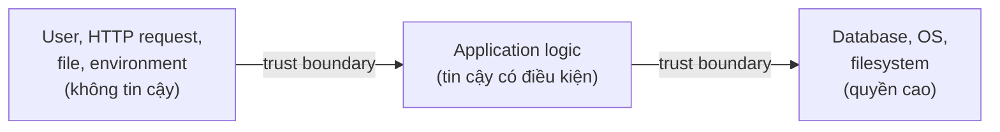
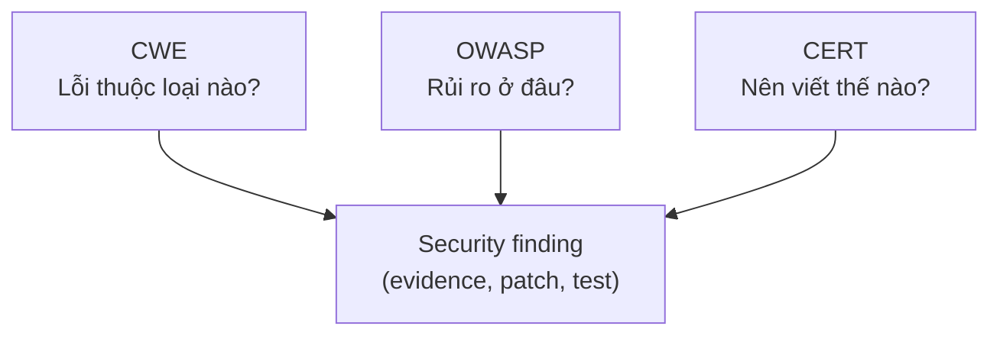
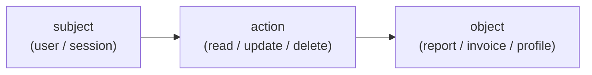
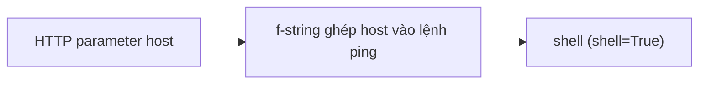

## Introduction

Hồi mới học lập trình, tiêu chuẩn duy nhất mình đặt ra cho một đoạn code là **phải chạy đúng**. Nhập dữ liệu vào, chương trình trả ra kết quả như mong đợi, không crash, không lỗi cú pháp, thế là xong. Cách nghĩ đó đúng, nhưng chưa đủ.

Sang phần security mình mới nhận ra một vấn đề: một đoạn code hoàn toàn có thể chạy đúng với dữ liệu hợp lệ, được review, test pass, lên production chạy mượt, rồi đổ vỡ ngay khi có người cố tình kiểm soát dữ liệu, trạng thái hoặc môi trường mà nó đang chạy trong đó. Không phải vì code viết sai, mà vì code đang **tin vào một điều gì đó** mà người khác phá vỡ được.

Bài viết dành cho người đã biết lập trình cơ bản (Python, một chút C) và hiểu sơ về web (HTTP request, SQL). Đọc xong, bạn sẽ có một bộ khái niệm để nói về lỗ hổng cho chính xác, một quy trình để biến nghi ngờ thành finding có evidence, và cách đánh giá một patch.

Bài gồm ba phần, xếp theo đúng thứ tự mình nghĩ khi ngồi đọc một đoạn code lạ:

1. **Hiểu** code không an toàn ở đâu.
2. **Chứng minh** điều đó bằng evidence.
3. **Sửa** và kiểm thử patch.

## From Working Code to Safe Code

Phần này gồm các khái niệm nền (code an toàn, trust boundary, source – transform – sink, security property), bộ từ vựng chung để gọi tên một finding, một ví dụ C cho thấy nhiều property nằm trong cùng một hàm ngắn, và các lớp weakness thường gặp. Đây là phần mình mất nhiều thời gian nhất để hiểu thấu.

Các đoạn code trong bài là đoạn trích minh họa; phần import và khởi tạo ứng dụng được lược bớt khi không ảnh hưởng đến lập luận.

### Core Concepts: From Unsafe Assumption to Security Property

#### Working Code vs Safe Code

**Code chạy đúng** là code đáp ứng yêu cầu chức năng với dữ liệu hợp lệ, trạng thái bình thường và người dùng hợp lệ. Ví dụ hàm tìm user theo tên: nhập `Alice` thì nó trả về đúng thông tin của Alice.

**Code an toàn** là code vẫn giữ được **thuộc tính bảo mật (security property)** ngay cả khi dữ liệu, trạng thái hoặc môi trường bị thao túng có chủ đích. Nghĩa là khi có người nhập một chuỗi kỳ lạ, khi một biến bị đổi giá trị ngoài luồng, hoặc khi một file trên hệ thống bị người khác kiểm soát, chương trình vẫn không vượt qua giới hạn an toàn của nó.

#### SQL Injection: The Concept in Practice

Xét hàm Python sau:

```python
import sqlite3

# Vulnerable
def find_user(name):
    conn = sqlite3.connect("app.db")
    query = f"SELECT id, name FROM users WHERE name='{name}'"
    return conn.execute(query).fetchall()
```

Với input bình thường như `Alice`, đoạn này chạy đúng. Nhưng hãy để ý chỗ `f"..."`: `name` được ghép trực tiếp vào câu SQL. Nghĩa là cú pháp truy vấn không còn do chương trình kiểm soát hoàn toàn nữa, nó phụ thuộc vào nội dung người dùng gửi lên.

Nếu người dùng gửi `name = "' OR '1'='1"`, câu truy vấn trở thành:

```sql
SELECT id, name FROM users WHERE name='' OR '1'='1'
```

Điều kiện `'1'='1'` luôn đúng, nên truy vấn trả về toàn bộ user trong bảng thay vì đúng một người. Đây là **SQL Injection**, lỗ hổng kinh điển nhất của web.

Chỗ bị phá vỡ là: developer tin rằng `name` luôn là dữ liệu. Thực tế, khi ghép chuỗi vào SQL, `name` trở thành một phần của câu lệnh truy vấn. Ký tự `'` hay `OR` tự nó không nguy hiểm. Vấn đề là **dữ liệu không tin cậy được đưa vào ngữ cảnh lệnh**.

#### Trust Boundary: Where Trust Is Re-established

**Trust boundary** là đường ranh giới giữa vùng ít tin cậy và vùng có quyền cao hơn.



Mỗi khi dữ liệu đi từ vùng ít tin cậy sang vùng có quyền cao hơn, chương trình phải thiết lập lại thuộc tính bảo mật bằng validation, authorization, encoding, sandbox hoặc cơ chế tương đương. Dữ liệu từ HTTP request đi vào server application là một lần vượt ranh giới. Nếu nó tiếp tục đi vào OS command hoặc database thì ranh giới quyền trở nên nghiêm trọng hơn nhiều, vì hậu quả khi bị phá vỡ lớn hơn hẳn.

#### Source – Transform – Sink: The Reading Frame

Mọi đoạn code đều có thể đọc theo ba điểm: **source → transform → sink**.

- **Source**: dữ liệu từ nơi không tin cậy (HTTP parameter, file upload, biến môi trường, message queue...).
- **Transform**: các bước xử lý trung gian (`strip()`, `escape()`, `format()`, `replace()`...).
- **Sink**: thao tác nguy hiểm (`open()`, `execute()`, `subprocess.run()`, `printf()`...).

Câu hỏi mấu chốt nằm ở giữa: **transform có thật sự tạo ra thuộc tính bảo mật mà sink cần không?** Nếu không, code vẫn chạy đúng nhưng không an toàn.

Ví dụ kinh điển về xử lý đường dẫn file:

```python
# Vulnerable
filename = request.args["file"]           # source
filename = filename.strip()               # transform
return open("/data/" + filename).read()   # sink
```

`strip()` chỉ bỏ khoảng trắng ở đầu và cuối chuỗi. Nó không ngăn `../`, không chuẩn hóa đường dẫn, không kiểm tra file có nằm trong thư mục cho phép hay không.

Với input `../../etc/passwd`, đường dẫn cuối cùng nằm ngoài thư mục `/data`. Đây là **Path Traversal**. Bài học: mỗi transform phải được đánh giá theo một security property cụ thể, không thể gọi chung chung là "đã sanitize".

#### Security Property: What a Sink Must Uphold

**Security property** là điều kiện bảo mật mà chương trình phải duy trì trước khi đi vào sink hoặc trước khi cấp quyền cho một hành động. Vài ví dụ:

- SQL command không bị thay đổi bởi input.
- Buffer không bị ghi quá kích thước.
- Error message không làm lộ secret.
- Path cuối cùng nằm trong thư mục cho phép.
- Dependency không được thêm tùy tiện.
- User hiện tại sở hữu tài nguyên đang đọc.

### Shared Vocabulary

Khái niệm giúp hiểu cơ chế, nhưng khi viết finding hoặc trao đổi với người khác thì cần bộ từ vựng chung để gọi đúng tên: phạm vi của secure coding và ba hệ thống phân loại.

#### Scope of Secure Coding: More Than Sanitizing Input

Một hiểu nhầm khá phổ biến, kể cả ở chính mình, là nghĩ secure coding chỉ là lọc input. Phạm vi thật của nó rộng hơn nhiều:

- Input validation và canonicalization.
- Memory safety và integer safety.
- Output encoding theo đúng context.
- File path và command execution an toàn.
- Authentication và session safety.
- Secrets không hard-code, không log nhầm.
- Authorization trước hành động nhạy cảm.
- Crypto API dùng đúng mục đích.
- Error handling không **fail-open** (lỗi nhưng vẫn cho qua).
- Dependency và API assumption rõ ràng.

Sanitization chỉ là một kỹ thuật trong danh sách đó. Secure coding là bảo vệ property của từng thao tác.

#### CWE, OWASP, CERT

Khi viết finding bảo mật, cần một ngôn ngữ chung để người khác hiểu. Ba hệ thống dưới đây không phải một cây phân cấp, mà trả lời ba câu hỏi khác nhau:



**CWE (Common Weakness Enumeration)** mô tả loại điểm yếu trong thiết kế hoặc hiện thực phần mềm. Nó giúp gọi tên root cause ở mức khái quát, so sánh với các lỗi đã biết và sửa từ gốc. Vài mã hay gặp:

- `CWE-89`: SQL Injection.
- `CWE-787`: Out-of-bounds Write.
- `CWE-78`: OS Command Injection.
- `CWE-134`: Format String.
- `CWE-22`: Path Traversal.
- `CWE-639`: Authorization Bypass Through User-Controlled Key (IDOR).
- `CWE-862`: Missing Authorization.

CWE hay bị nhầm với CVE. **CWE là lớp điểm yếu** (loại lỗi), còn **CVE là một lỗ hổng cụ thể** trong một sản phẩm, phiên bản hoặc cấu hình, có mã định danh riêng. Một CWE như `CWE-787` có thể ứng với rất nhiều CVE ở nhiều sản phẩm khác nhau.

**OWASP Top 10** gom các rủi ro quan trọng trong ứng dụng web, giúp giải thích vì sao một weakness có ý nghĩa thực tế với hệ thống và người dùng. Ví dụ `A05:2025 Injection` bao gồm SQL injection, command injection, LDAP injection hoặc template injection, tức là một nhóm OWASP chứa nhiều CWE khác nhau.

**SEI CERT Coding Standard** đưa ra quy tắc lập trình cụ thể cho từng ngôn ngữ, đặc biệt hữu ích khi phân tích C và C++ vì lỗi bộ nhớ, chuỗi và số nguyên ở hai ngôn ngữ này thường dẫn đến vulnerability nghiêm trọng. Vài rule quen thuộc:

- `STR31-C`: cấp đủ bộ nhớ cho chuỗi và ký tự kết thúc.
- `ARR30-C`: không dùng chỉ số mảng ngoài biên.
- `INT32-C`: tránh overflow số nguyên có dấu.
- `ENV33-C`: không gọi `system()` tùy tiện.

### One Function, Multiple Properties

Đoạn C dưới đây cho thấy một hàm ngắn có thể chứa nhiều thao tác nhạy cảm, và mỗi thao tác cần một property riêng.

```c
#include <stdio.h>
#include <string.h>

// Vulnerable
void greet(const char *name) {
    char buffer[16];
    strcpy(buffer, name);
    printf("Hello ");
    printf(buffer);
    printf("\n");
}
```

Nhìn qua thì đây chỉ là một hàm in lời chào, nhưng có hai chỗ hỏng độc lập trong đó.

#### Finding 1: Unsafe Copy, an Out-of-bounds Write

```c
char buffer[16];
strcpy(buffer, name);
```

`name` đi vào `strcpy`, mà hàm này không biết kích thước của `buffer`. Nếu input dài hơn vùng nhớ đích, chương trình ghi ngoài biên. Mapping: `CWE-787` Out-of-bounds Write, CERT liên quan `STR31-C`.

#### Finding 2: Format String from Input

```c
printf(buffer);
```

Tham số đầu tiên của `printf` được diễn giải như format string. Nếu `buffer` chứa dữ liệu do người dùng kiểm soát, họ có thể ảnh hưởng cách `printf` đọc tham số: `%x` đọc dữ liệu trên stack, `%n` ghi vào bộ nhớ. Mapping: `CWE-134` Externally-Controlled Format String.

### Weakness Classes

Các ví dụ trên cho thấy cùng một mô hình lặp lại: dữ liệu không tin cậy đi vào một context có grammar riêng. Phần này gom chúng thành vài lớp weakness thường gặp, đi từ root cause chung tới context cụ thể.

#### Injection: One Root Cause, Many Contexts

Cùng một root cause nhưng nhiều context khác nhau:

- **SQL**: dữ liệu trở thành cú pháp truy vấn.
- **Shell**: dữ liệu trở thành toán tử hoặc lệnh.
- **HTML**: dữ liệu trở thành markup hoặc script.
- **Template**: dữ liệu trở thành biểu thức template.
- **LDAP/XPath**: dữ liệu trở thành điều kiện truy vấn.
- **Log**: dữ liệu làm giả dòng log hoặc che giấu hành vi.

Mỗi sink có grammar riêng, nên phòng vệ phải đúng grammar đó.

#### XSS: The Fix Depends on Output Context

Xét ba vị trí chèn cùng một biến `name`:

```html
<div>Hello, {{ name }}</div>

<script> const user = "{{ name }}"; </script>

<a href="/search?q={{ name }}">Search</a>
```

Không có một kiểu encode dùng chung cho cả ba. HTML body, JavaScript string và URL parameter là ba context khác nhau, và auto-escaping của template engine không đồng nghĩa với an toàn trong mọi context. Cách sửa tương ứng:

- **HTML body**: HTML-escape.
- **JavaScript string**: serialize bằng JSON (ví dụ filter `tojson` của Jinja2) thay vì tự nối chuỗi.
- **URL parameter**: URL-encode.

Lỗi này là **XSS**: dữ liệu người dùng trở thành markup hoặc script trong trang.

#### Authorization: Subject, Action, Object



Property cần có: subject chỉ được thực hiện action trên object nếu policy cho phép. Kiểm tra đăng nhập không đủ để chứng minh property này.

#### IDOR: Authorization Broken in Practice

```javascript
// Vulnerable
app.get("/profile", async (req, res) => {
  const id = req.query.id;
  const user = await db.query(
    `SELECT * FROM users WHERE id=${id}`
  );
  res.send(user);
});
```

Đoạn code ngắn này chứa ba vấn đề độc lập:

- **SQL injection** do string interpolation (`CWE-89`).
- **IDOR** vì người dùng tự chọn `id` của người khác (`CWE-639`).
- **Excessive data exposure** vì `SELECT *` trả về cả trường không cần thiết.

Một đoạn code có thể chứa nhiều weakness với root cause khác nhau, nên đừng dừng lại sau khi tìm thấy lỗi đầu tiên.

## Evidence-Based Code Review

Phần này là chỗ mình học cách biến một nghi ngờ trong đầu thành thứ người khác kiểm chứng được: review là gì, ghi finding thế nào cho chuẩn, theo dõi một endpoint từ source đến finding, và xử lý cảnh báo của công cụ.

### Review Foundations

**Secure code review** là quá trình đọc code để tìm nơi security property có thể bị phá vỡ, sau đó **chứng minh** bằng data flow, control flow, test, trace hoặc lập luận kỹ thuật.

Năm câu hỏi cần trả lời khi review:

1. Attacker có thể kiểm soát dữ liệu, trạng thái hoặc luồng nào?
2. Dữ liệu đó đi qua những biến, hàm và nhánh điều kiện nào?
3. Nó có tới thao tác nhạy cảm nào không?
4. Thao tác đó cần assumption hoặc property nào để an toàn?
5. Evidence nào chứng minh property được giữ hoặc bị phá vỡ?

### Documenting Findings: Confidence and Assumptions

Sau khi theo dõi xong data flow, cần một cách ghi lại kết quả đủ chuẩn để người khác kiểm chứng: mẫu finding, mức tin cậy và các giả định đứng sau kết luận.

#### A Finding Needs Evidence

| Finding yếu | Finding tốt |
|---|---|
| "Có thể bị SQL injection." | "Input `name` từ request được ghép vào SQL string tại dòng X và thực thi tại dòng Y. Payload Z làm thay đổi mệnh đề WHERE." |
| Không có source, sink, payload, đường dữ liệu hoặc property bị vi phạm | Có location, source, sink, payload và property |

Một finding tốt có thể sai severity, nhưng không được thiếu evidence.

#### Security Finding Template

| Thành phần | Nội dung |
|---|---|
| **Location** | File, function, line hoặc đoạn logic liên quan |
| **Source** | Dữ liệu hoặc trạng thái attacker có thể kiểm soát |
| **Sink** | Thao tác nhạy cảm nhận dữ liệu đó |
| **Property** | Điều kiện bảo mật cần được giữ |
| **Evidence** | Data flow, payload, trace, test hoặc lập luận cụ thể |
| **Impact** | Tài sản hoặc quyền bị ảnh hưởng |
| **Mapping** | CWE (và OWASP, CERT nếu liên quan) |
| **Confidence** | Mức tin cậy của kết luận (xem bảng dưới) |
| **Patch** | Thay đổi loại bỏ root cause |
| **Test** | Normal, malicious và boundary case |

#### Confidence Levels

| Mức | Ý nghĩa |
|---|---|
| **Confirmed** | Đã tái lập được, ví dụ payload chạy được trong môi trường cô lập |
| **Likely** | Data flow rõ ràng và không thấy guard, nhưng chưa tái lập |
| **Needs evidence** | Mới thấy cảnh báo hoặc pattern đáng ngờ, chưa chứng minh gì |
| **Rejected** | Đã chứng minh property được giữ, nên không phải vulnerability |

#### Assumptions in Security Analysis

**Assumption** là một điều kiện được xem là đúng để chương trình hoặc lập luận bảo mật hoạt động, dù điều kiện đó có thể chưa được kiểm tra hay thực thi bằng code.

Ba câu hỏi để tìm assumption:

1. Điều gì phải đúng để sink an toàn?
2. Điều kiện đó được kiểm tra ở đâu?
3. Attacker có thể làm điều kiện đó sai không?

Assumption trở thành rủi ro khi code dựa vào điều kiện đó nhưng không có validation, guard, authorization hoặc cơ chế tương đương để duy trì nó.

Quay lại đoạn `open("/data/" + filename)` ở phần Source – Transform – Sink. Developer ngầm tin `filename` chỉ là một tên file đơn giản và kết quả luôn nằm trong thư mục `/data`. Cách kiểm chứng: thử input như `../../etc/passwd`, đồng thời tìm allowlist, canonicalization và containment check trong đường code thực tế.

Vì vậy, đừng chỉ hỏi "developer đang tin điều gì?". Phải tìm evidence cho thấy assumption đó **được thực thi** hoặc **có thể bị attacker phá vỡ**.

### Tracing One Endpoint: Command Injection

Mình lấy một endpoint duy nhất rồi đi hết quy trình trên nó. Endpoint dưới đây là thứ mình gặp khá nhiều khi đọc code thật:

```python
from flask import request
import subprocess

# Vulnerable
@app.get("/ping")
def ping():
    host = request.args.get("host")
    result = subprocess.run(
        f"ping -c 1 {host}",
        shell=True, capture_output=True, text=True
    )
    return result.stdout
```

**Bước 1: source và trust boundary.** `request.args.get("host")` lấy dữ liệu từ HTTP query parameter, tức là dữ liệu do client điều khiển. Dữ liệu đi từ client không tin cậy vào server application; nếu sau đó nó đi vào OS command thì ranh giới quyền trở nên nghiêm trọng hơn.

**Bước 2: sink và quyền bị chạm tới.** `subprocess.run(..., shell=True)` tạo shell command, mà shell có thể diễn giải ký tự đặc biệt như toán tử lệnh. Từ HTTP input, attacker có cơ hội ảnh hưởng thao tác thực thi lệnh trên server. Đây là bước chuyển từ **dữ liệu** sang **capability**, và đó là lý do sink này nguy hiểm.

**Bước 3: data flow.**



Property bị vi phạm: `host` phải là dữ liệu host, nhưng trong shell context nó có thể trở thành cú pháp lệnh.

**Bước 4: payload chứng minh.**

```http
GET /ping?host=127.0.0.1;id
```

Lệnh thực tế trở thành:

```bash
ping -c 1 127.0.0.1;id
```

Nếu shell nhận toàn bộ chuỗi trên, phần `id` có thể được chạy như một lệnh riêng. Evidence có thể là output lệnh, log, hoặc test tái lập trong môi trường cô lập.

**Bước 5: viết finding ngắn gọn.**

```text
Finding: OS command injection in /ping.
Location: ping(), subprocess.run(... shell=True).
Source: query parameter host.
Sink: shell command execution.
Property: host must be treated as data, not shell syntax.
Evidence: host=127.0.0.1;id changes the executed command.
Impact: attacker may execute OS commands with process privilege.
Mapping: CWE-78 OS Command Injection.
Confidence: Confirmed if reproduced in sandbox; otherwise Likely.
Patch: validate host with ipaddress; call ping with an argument list, shell=False.
Test: normal, malicious and boundary cases (see "Testing the Patch").
```

Finding tốt không cần dài, nhưng phải đủ đường suy luận.

### Tool Alerts: From Candidate to Verdict

Walkthrough ở trên là review thủ công. Thực tế mình thường bắt đầu từ một cảnh báo của SAST, và cảnh báo chỉ là **candidate**: verdict hoàn toàn có thể là **Rejected**.

#### A Path Traversal Alert

Giả sử SAST báo: *"Dữ liệu `name` được nối vào path tại `open()`, có thể dẫn đến path traversal."*

```python
SAFE_FILES = {"help.txt", "terms.txt"}

def read_public_file(name):
    if name not in SAFE_FILES:
        raise PermissionError()
    return open("/srv/public/" + name).read()
```

Theo dõi data flow trước: `name` có thể đến từ người dùng, nhưng chỉ riêng điều này chưa đủ để xác nhận lỗ hổng. Guard ở đây là điều kiện membership, chỉ cho phép đúng hai chuỗi `help.txt` và `terms.txt` đi tiếp. `open()` đúng là thao tác nhạy cảm, nhưng nó chỉ nhận giá trị đã vượt qua guard. Payload `../../etc/passwd` không thuộc allowlist nên bị chặn trước sink.

Vì vậy, với cảnh báo cụ thể này, nếu guard luôn chạy và allowlist không bị attacker thay đổi, giả thuyết "attacker đưa `../` qua `name`" bị bác bỏ và finding nên được đánh dấu **Rejected**. Phép nối path đúng là pattern đáng chú ý, nhưng **guard quyết định** pattern đó có trở thành vulnerability hay không.

Verdict vẫn có điều kiện, vì còn mấy thứ cần kiểm:

1. **Tính toàn vẹn của allowlist**: `SAFE_FILES` có bị cấu hình hoặc request khác sửa được không?
2. **Control flow**: có đường gọi nào đi thẳng tới `open()` và bỏ qua guard không?
3. **Filesystem**: attacker có tạo hoặc thay symlink `help.txt` / `terms.txt` trong `/srv/public` để trỏ ra ngoài không?
4. **Phạm vi kết luận**: nếu symlink do attacker kiểm soát, đó là một đường rủi ro khác cần finding riêng; nó không làm payload `../` vượt qua allowlist.

Confidence đi theo đúng đường đó: mới thấy cảnh báo là **Needs evidence**, sau khi xác nhận guard và các giả định trên thì mới hạ xuống **Rejected**. Công cụ tìm candidate, còn reviewer dùng evidence để xác nhận, hạ mức hoặc loại finding.

## Fixing and Testing Patches

Một patch đúng khi nó khôi phục property bị phá vỡ, không chỉ chặn payload đã thấy. Phần này đi từ bốn thao tác phòng vệ chung, áp vào các ví dụ ở trên, rồi kiểm thử patch.

### Four Defensive Operations: Validate, Canonicalize, Encode, Parameterize

Bốn thao tác này rất dễ bị nhầm với nhau, nên mình tách ra thành bảng:

| Thao tác | Việc nó làm | Ví dụ |
|---|---|---|
| **Validate** | Kiểm tra input có thuộc tập hợp được phép không: type, length, range, format, allowlist | Chỉ chấp nhận chuỗi là IPv4/IPv6 hợp lệ |
| **Canonicalize** | Chuyển nhiều biểu diễn về một dạng chuẩn trước khi kiểm tra | Chuẩn hóa path, Unicode, URL encoding |
| **Encode** | Biểu diễn dữ liệu an toàn trong một output context | HTML, JavaScript, URL, SQL literal |
| **Parameterize** | Tách dữ liệu khỏi lệnh/truy vấn | Prepared statement, argument list, safe API |

Không có một hàm `sanitize()` chung cho mọi context.

### Fixing the Ping Endpoint

#### A Failed Fix: Character Blocklist

Một hướng sửa thường gặp:

```python
# Still vulnerable
host = host.replace(";", "")
host = host.replace("&&", "")
subprocess.run(f"ping -c 1 {host}", shell=True)
```

Cách này yếu vì blocklist thường bỏ sót biến thể cú pháp shell: quoting, newline, command substitution (`$(...)`, backtick), hoặc khác biệt giữa các shell. Quan trọng hơn cả, code vẫn đưa dữ liệu không tin cậy vào shell. Patch không nên chỉ chặn payload đã thấy; nó phải loại bỏ đường đi tới root cause.

#### A Fix That Restores the Property

Giả sử có người đề xuất patch này:

```python
import ipaddress
import subprocess
from flask import request

# Fixed
@app.get("/ping")
def ping():
    host = request.args.get("host", "")
    try:
        ip = ipaddress.ip_address(host)
    except ValueError:
        return {"error": "invalid host"}, 400
    return subprocess.run(
        ["ping", "-c", "1", str(ip)],
        shell=False, timeout=3, capture_output=True, text=True
    ).stdout
```

Patch này sửa được gì?

1. **Validation**: `ip_address(host)` chỉ chấp nhận chuỗi biểu diễn IPv4/IPv6, nên payload như `127.0.0.1; id` bị từ chối trước khi tới sink.
2. **Argument list**: `["ping", "-c", "1", str(ip)]` truyền chương trình và từng đối số riêng, thay vì tạo một command string.
3. **Không dùng shell**: `shell=False` gọi chương trình trực tiếp, nên các toán tử như `;`, `&&` hoặc pipe không được shell diễn giải.

Property được khôi phục: input chỉ được dùng như một địa chỉ IP đã kiểm tra, không thể thay đổi cấu trúc lệnh hay chèn thêm option tùy ý. Hai cơ chế bổ sung cho nhau: argument list sửa đường dữ liệu, validation giới hạn miền giá trị. Nếu chỉ dùng argument list mà bỏ validation, `host=-f` vẫn được truyền xuống như một option của `ping` (argument injection).

#### What the Patch Still Does Not Cover

- **Validation cú pháp chưa phải policy**: `ip_address` xác nhận đây là IP hợp lệ, nhưng không quyết định ứng dụng có được ping loopback, private, link-local hoặc địa chỉ nội bộ hay không. Đây là quyết định nghiệp vụ: ai được dùng chức năng, được ping phạm vi nào, có cần allowlist mạng đích không.
- **Giới hạn lạm dụng tài nguyên**: `timeout=3` giới hạn một lần chạy nhưng chưa thay thế rate limit, giới hạn đồng thời, quyền tối thiểu và giám sát lỗi.
- **Phạm vi kết luận**: patch đã xử lý root cause của command injection trong đường code này, nhưng chưa chứng minh toàn bộ tính năng `/ping` an toàn.

Sửa một weakness không tự động khôi phục mọi security property của feature đó.

### Fixing Other Sinks

#### SQL: Prepared Statements

Quay lại ví dụ SQL Injection, cách sửa đúng là tách dữ liệu khỏi cú pháp:

```python
import sqlite3

# Fixed
def find_user(name):
    conn = sqlite3.connect("app.db")
    query = "SELECT id, name FROM users WHERE name = ?"
    return conn.execute(query, (name,)).fetchall()
```

Input `name` giờ được truyền như dữ liệu, không ghép vào cú pháp SQL; database driver chịu trách nhiệm binding tham số. Patch đúng nguyên nhân vì nó khôi phục property bị phá vỡ, không chỉ loại bỏ payload đang thấy.

#### Path Traversal: Check After Canonicalization

```python
from pathlib import Path

BASE = Path("/srv/reports").resolve()

# Fixed
def read_report(filename):
    target = (BASE / filename).resolve()
    if BASE not in target.parents and target != BASE:
        raise PermissionError("outside report directory")
    return target.read_bytes()
```

Property cần giữ: path cuối cùng **sau khi resolve** phải nằm trong thư mục cho phép. Điểm cốt lõi là resolve/chuẩn hóa trước rồi mới kiểm tra containment. Kiểm tra trước khi canonicalize thường dễ bị bypass, vì lúc đó đang so sánh trên một chuỗi mà attacker còn có thể biến đổi thêm.

#### IDOR: Check Ownership

Quay lại endpoint `/profile` ở phần Weakness Classes. Cả ba vấn đề được sửa trong cùng một đoạn:

```javascript
// Fixed (placeholder $1 theo driver PostgreSQL)
app.get("/profile", requireLogin, async (req, res) => {
  const id = Number(req.query.id);
  if (!Number.isInteger(id)) {
    return res.status(400).json({ error: "invalid id" });
  }
  if (id !== req.user.id && !req.user.isAdmin) {
    return res.status(403).json({ error: "forbidden" });
  }
  const result = await db.query(
    "SELECT id, name FROM users WHERE id = $1",
    [id]
  );
  res.json(result.rows[0]);
});
```

- **SQL injection**: tham số hóa truy vấn thay vì nối chuỗi.
- **IDOR**: kiểm tra quan hệ subject – action – object trước khi đọc dữ liệu.
- **Data exposure**: chỉ chọn các cột cần thiết thay vì `SELECT *`.

Ai được xem profile của ai vẫn là quyết định nghiệp vụ; đoạn code chỉ thực thi policy đó, không tự quyết định thay.

### Fixing the C Function: Memory, Not Policy

```c
#include <stdio.h>

// Fixed
void greet(const char *name) {
    printf("Hello %s\n", name);
}
```

Patch này loại bỏ buffer trung gian nên không còn `strcpy` ghi ngoài biên, và format cố định `"%s"` buộc `name` được xử lý như dữ liệu thay vì format string. Hai property kỹ thuật đã được khôi phục, nhưng còn vài thứ chưa được giải quyết:

- **C string contract**: chuỗi C không mang độ dài, hàm phải dò tới `'\0'` để biết điểm dừng. `name` phải là con trỏ khác `NULL` trỏ tới mảng có `'\0'` ở cuối (`'\0'` là ký tự kết thúc, còn `NULL` là con trỏ rỗng). Vi phạm sẽ dẫn tới undefined behavior.
- **Độ dài và Unicode**: "tối đa 50 ký tự" mơ hồ với máy: 50 byte, 50 code point hay 50 grapheme cluster? Cần chốt đơn vị đo ngay từ đầu, và chuẩn hóa (ví dụ NFC) trước khi so sánh, vì `é` có thể là `U+00E9` hoặc `e` + `U+0301`.
- **Control character**: `\n` và `\r` gây log injection, `ESC` (`U+001B`) gây terminal escape injection, `U+202E` (right-to-left override) được dùng trong Trojan Source. Nên dùng allowlist thay vì blocklist.

Patch đã sửa lỗi bộ nhớ nhưng chưa thực thi quy tắc nghiệp vụ về tính hợp lệ của tên. Đó là lý do mình luôn tự hỏi: "patch này sửa property nào, và còn property nào để mở?"

### Testing the Patch

Patch chưa xong nếu chưa có test chứng minh nó hoạt động. Mỗi patch cần ba nhóm case: **normal** (hành vi đúng vẫn chạy), **malicious** (payload bị chặn) và **boundary** (giá trị sát biên). Với endpoint `/ping`:

```python
import pytest
from app import app

client = app.test_client()

@pytest.mark.parametrize("host, expected", [
    ("127.0.0.1", 200),       # normal (mock subprocess.run trong CI)
    ("::1", 200),             # boundary: IPv6
    ("", 400),                # boundary: rỗng
    ("127.0.0.1\n", 400),     # boundary: ký tự xuống dòng
    ("127.0.0.1;id", 400),    # malicious: command separator
    ("$(id)", 400),           # malicious: command substitution
    ("-f", 400),              # malicious: option injection
])
def test_ping(host, expected):
    resp = client.get("/ping", query_string={"host": host})
    assert resp.status_code == expected
```

Các test malicious nên fail trên code cũ và pass trên code đã patch. Như vậy test vừa chứng minh patch hoạt động, vừa là regression test giữ cho lỗi không quay lại.

### Cross-Cutting Practices: Rules That Apply Everywhere

Những quy tắc dưới đây không gắn với một sink cụ thể: xử lý lỗi, quản lý secret, secure default, least privilege và code dễ kiểm chứng.

**Error handling: fail closed.** Khi bước kiểm tra bảo mật gặp lỗi, mặc định phải là từ chối, không phải cho qua. Rất nhiều lỗi nghiêm trọng đến từ một `try/except` nuốt exception rồi chạy tiếp.

**Secrets.** Không hard-code, không commit file cấu hình chứa key, không log token, không dán secret vào prompt công cộng. Dùng secret manager hoặc biến môi trường cấp quyền tối thiểu, bật secret scanning, mask trong log và xoay khóa khi lộ. Secret đã commit vào repository phải coi là **đã lộ**: xóa khỏi commit mới nhất là chưa đủ, vì nó vẫn nằm trong lịch sử git.

**Secure default và least privilege.** Mặc định từ chối, giới hạn quyền, tắt debug, không expose dữ liệu thừa, đặt timeout rõ ràng. Function, process, token và service account chỉ giữ quyền cần thiết cho nhiệm vụ. Quyền càng rộng thì impact khi có lỗi càng lớn.

**Code an toàn phải dễ kiểm chứng.** Code càng khó chứng minh property thì càng dễ bỏ sót lỗ hổng khi review.

## Conclusion

Điểm mình rút ra sau khi đi hết ba phần: code chạy đúng chỉ là điều kiện cần. Muốn đánh giá một đoạn code lạ, mình quay về năm câu hỏi review, rồi ghi kết quả thành finding có source, sink, property và evidence. Khi đánh giá một patch, mình hỏi:

> Patch này khôi phục property nào, và property nào vẫn còn để mở?

Nếu trả lời được câu đó bằng evidence và test, patch mới thật sự có giá trị.

## References

- [CWE: Common Weakness Enumeration](https://cwe.mitre.org/)
- [OWASP Top 10](https://owasp.org/www-project-top-ten/)
- [SEI CERT C Coding Standard](https://wiki.sei.cmu.edu/confluence/display/c/SEI+CERT+C+Coding+Standard)