## Virtual Hosts

**Virtual Hosts** là một kỹ thuật cấu hình trên web server cho phép một máy duy nhất phục vụ nhiều website hoặc domain khác nhau. Apache sẽ đọc giá trị trong `Host` header của HTTP request, sau đó chọn đúng virtual host để trả về nội dung từ `DocumentRoot` tương ứng.

Điều này có nghĩa là:

- nhiều domain có thể cùng trỏ về một server
- mỗi domain có thể có một thư mục source riêng
- Apache vẫn phân biệt được website nào cần phục vụ dù request cùng đi vào cổng `80`

Trong bài này, mình sẽ cấu hình Apache để phục vụ hai domain:

- `littlenopro.io.vn`
- `littlenopro.id.vn`

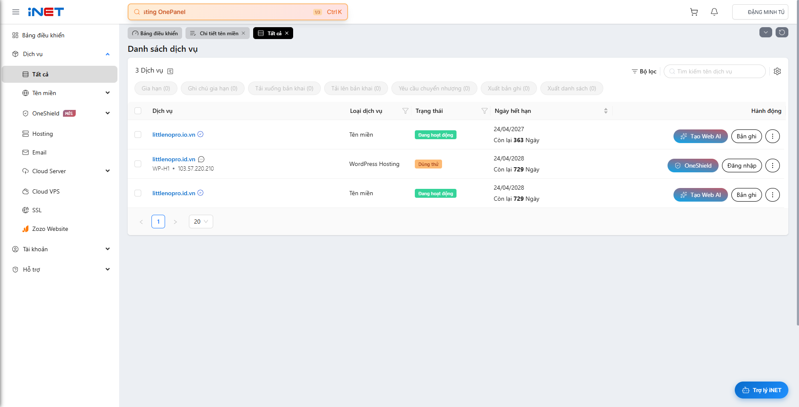

## Setup Apache web server on Ubuntu

Apache thường phục vụ source web bên trong `/var/www`. Mình sẽ tạo một thư mục riêng cho mỗi domain:

```bash
sudo mkdir -p /var/www/littlenopro.io.vn/public_html
sudo mkdir -p /var/www/littlenopro.id.vn/public_html
```

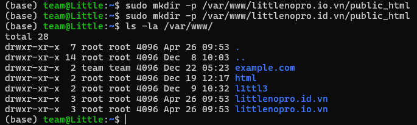

Sau khi tạo xong, hai thư mục này thường thuộc quyền sở hữu của `root`. Để user hiện tại có thể chỉnh sửa nội dung dễ dàng hơn, mình đổi lại quyền sở hữu:

```bash
sudo chown -R $USER:$USER /var/www/littlenopro.io.vn/public_html
sudo chown -R $USER:$USER /var/www/littlenopro.id.vn/public_html
```

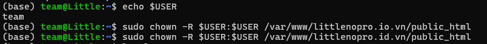

Để kiểm tra Apache có phân phối đúng nội dung cho từng domain hay không, mình tạo file `index.html` riêng cho từng website.

Với `littlenopro.io.vn`:

```bash
nano /var/www/littlenopro.io.vn/public_html/index.html
```

Ví dụ nội dung:

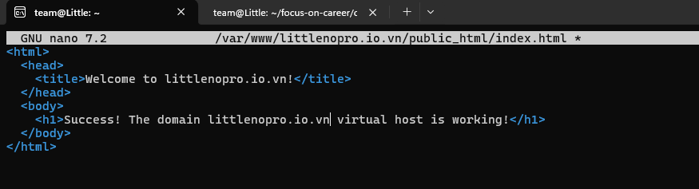

(Sau đó làm tương tự với `littlenopro.id.vn`)


Trong Apache, file `000-default.conf` là virtual host mặc định. Nếu request không khớp với `ServerName` hoặc `ServerAlias` nào khác, Apache sẽ fallback về site này.

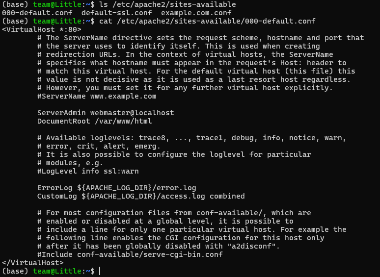

Mình sẽ tạo hai file cấu hình mới trong `/etc/apache2/sites-available/` dựa trên file mặc định:

```bash
sudo cp /etc/apache2/sites-available/000-default.conf /etc/apache2/sites-available/littlenopro.io.vn.conf
sudo cp /etc/apache2/sites-available/000-default.conf /etc/apache2/sites-available/littlenopro.id.vn.conf
```

Với `littlenopro.io.vn`, mình sửa file như sau:

```bash
sudo nano /etc/apache2/sites-available/littlenopro.io.vn.conf
```

```apache
<VirtualHost *:80>
    ServerAdmin webmaster@localhost
    ServerName littlenopro.io.vn
    ServerAlias www.littlenopro.io.vn
    DocumentRoot /var/www/littlenopro.io.vn/public_html

    ErrorLog ${APACHE_LOG_DIR}/error.log
    CustomLog ${APACHE_LOG_DIR}/access.log combined
</VirtualHost>
```

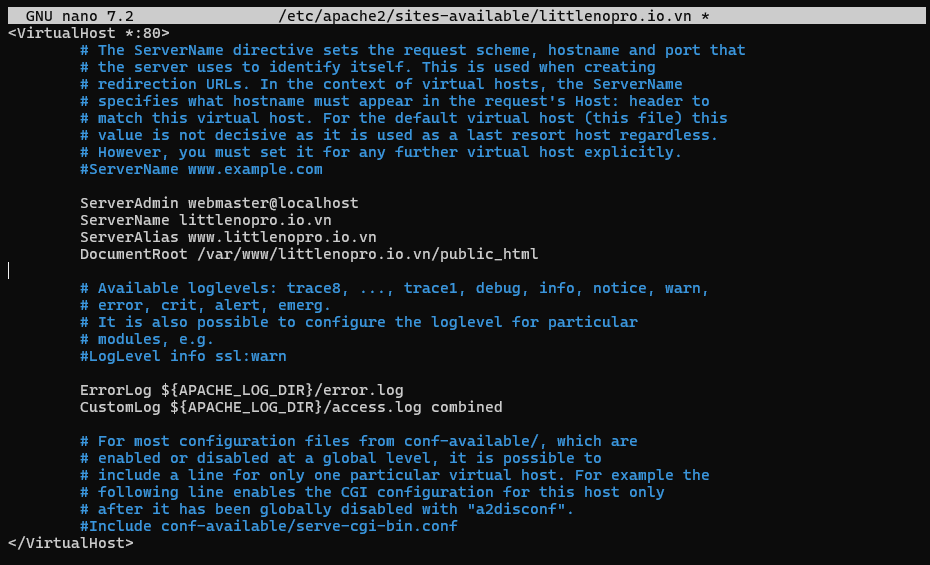

Với `littlenopro.id.vn`, nội dung tương tự:

```bash
sudo nano /etc/apache2/sites-available/littlenopro.id.vn.conf
```

```apache
<VirtualHost *:80>
    ServerAdmin webmaster@localhost
    ServerName littlenopro.id.vn
    ServerAlias www.littlenopro.id.vn
    DocumentRoot /var/www/littlenopro.id.vn/public_html

    ErrorLog ${APACHE_LOG_DIR}/error.log
    CustomLog ${APACHE_LOG_DIR}/access.log combined
</VirtualHost>
```

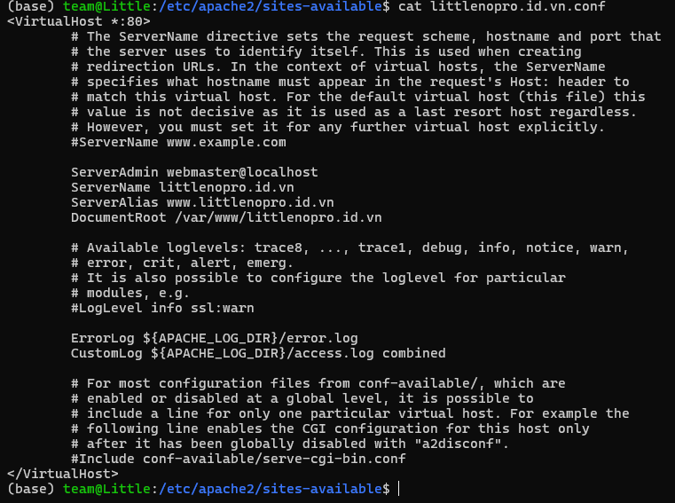

Sau khi cấu hình xong, bật hai site mới:

```bash
sudo a2ensite littlenopro.io.vn.conf
sudo a2ensite littlenopro.id.vn.conf
```

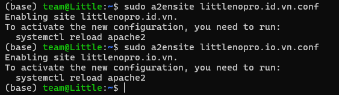

Nếu không muốn Apache fallback sang site mặc định nữa, có thể tắt `000-default.conf`:

```bash
sudo a2dissite 000-default.conf
```

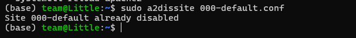

Cuối cùng, kiểm tra cú pháp và khởi động lại Apache:

```bash
sudo apache2ctl configtest
sudo systemctl restart apache2
sudo systemctl status apache2
```

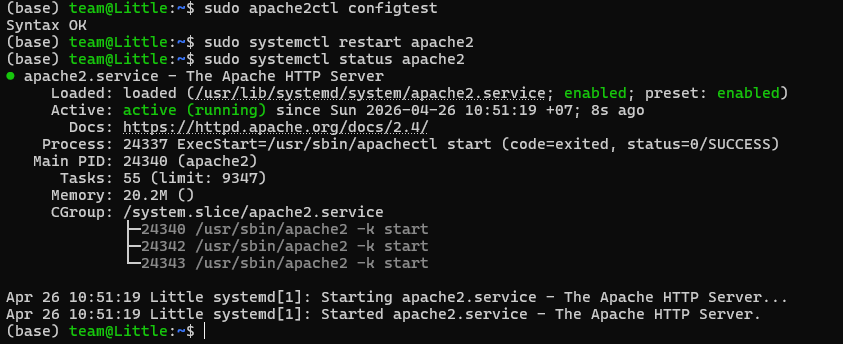

Trước khi cấu hình DNS hay Tunnel, mình sẽ kiểm tra Apache ở local để chắc chắn hai virtual host đã hoạt động đúng. Cách nhanh nhất là dùng `curl` và tự truyền `Host` header:

```bash
curl -H "Host: littlenopro.io.vn" http://127.0.0.1
curl -H "Host: littlenopro.id.vn" http://127.0.0.1
```

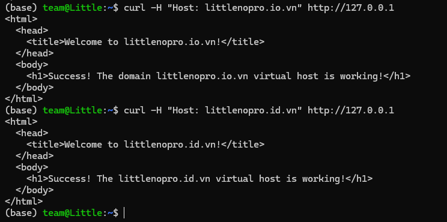

Nếu ta chạy website trên máy cá nhân, WSL, hoặc một máy trong mạng gia đình, việc trỏ `A record` trực tiếp về public IP thường phát sinh nhiều vấn đề:

- cần mở port `80` và `443` trên router
- nhiều nhà mạng dùng `CGNAT`
- public IP có thể thay đổi khi đổi Wi-Fi hoặc reboot modem
- website dễ mất kết nối nếu mạng không ổn định

Vì vậy trong bài viết này mình sẽ dùng **Cloud flare Tunnel** để cấu hình:

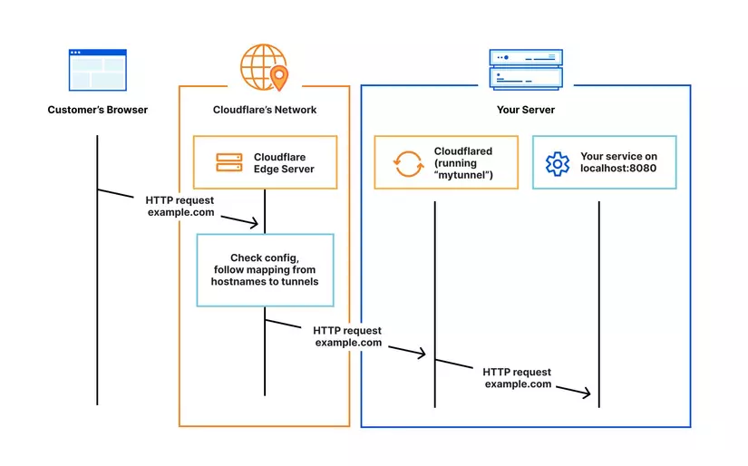

Điểm quan trọng là cả bốn hostname:

- `littlenopro.io.vn`
- `www.littlenopro.io.vn`
- `littlenopro.id.vn`
- `www.littlenopro.id.vn`

đều có thể đi vào cùng `http://127.0.0.1:80`, vì Apache sẽ tự chọn đúng website dựa trên `Host` header của request.

Việc đầu tiên cần làm là đưa cả hai domain vào Cloudflare để quản lý DNS tại đó.

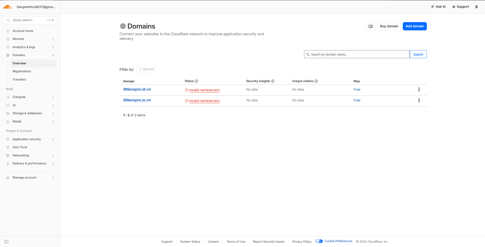

Sau khi thêm domain vào Cloudflare, hệ thống sẽ cấp cho ta 2 nameserver mới. Mình sẽ vào trang quản lý domain ở **iNET** để thay nameserver cũ bằng nameserver mà Cloudflare cung cấp.

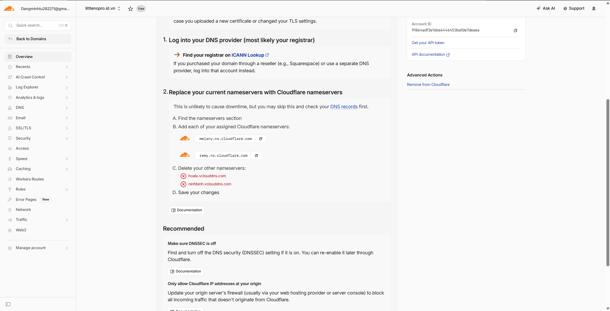
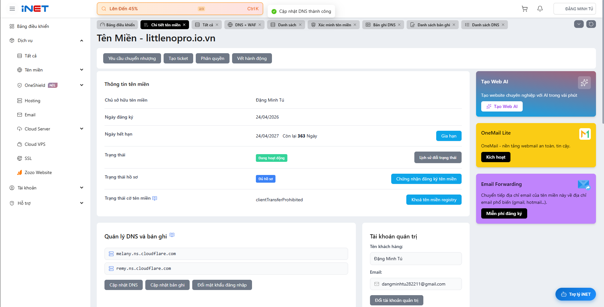
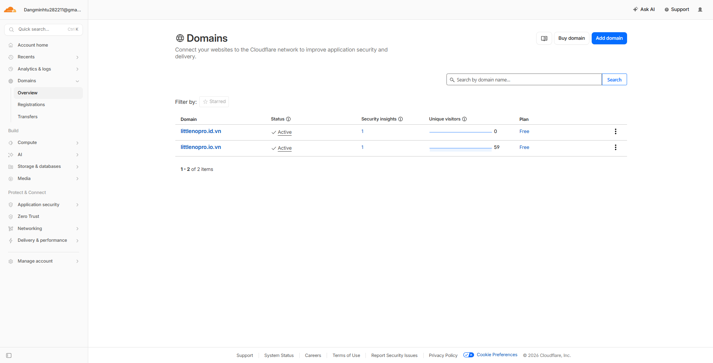

Tiếp theo, cài `cloudflared` trên Ubuntu:

```bash
sudo mkdir -p --mode=0755 /usr/share/keyrings
curl -fsSL https://pkg.cloudflare.com/cloudflare-main.gpg | sudo tee /usr/share/keyrings/cloudflare-main.gpg >/dev/null
echo "deb [signed-by=/usr/share/keyrings/cloudflare-main.gpg] https://pkg.cloudflare.com/cloudflared any main" | sudo tee /etc/apt/sources.list.d/cloudflared.list
sudo apt-get update
sudo apt-get install cloudflared
```

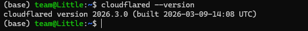

Sau đó đăng nhập Cloudflare từ command line:

```bash
cloudflared tunnel login
```
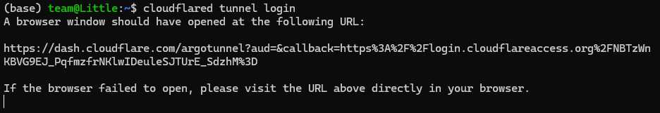

Lệnh này dùng để lấy một chứng chỉ (certificate) từ Cloudflare về máy của mình. Cert này sẽ cho phép ta tạo ra các "tunnel" bảo mật để đưa một service đang chạy ở localhost ra ngoài Internet. Mình sẽ mở link này trên browser rồi chọn domain `littlenopro.id.vn`:

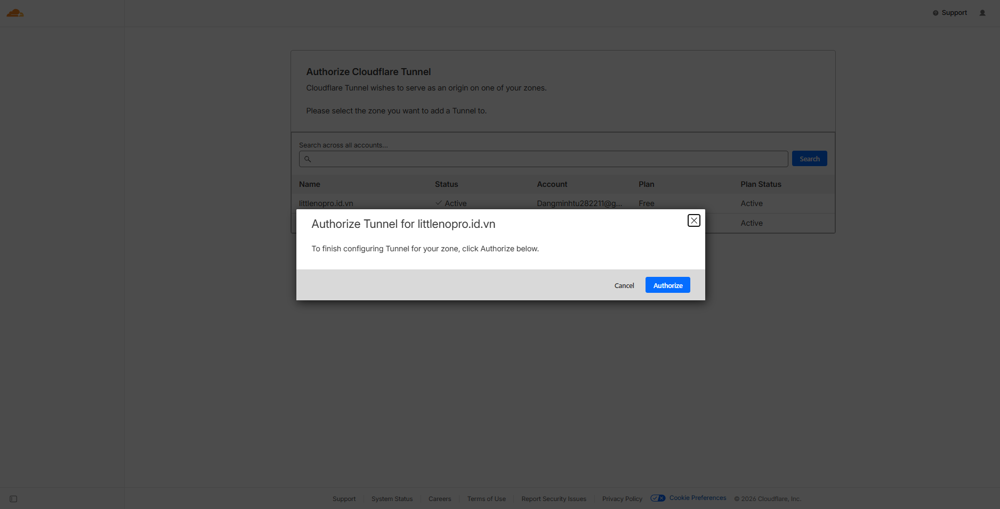

Tạo một tunnel mới:

```bash
cloudflared tunnel create littlenopro
```

Sau lệnh này, Cloudflare sẽ trả về `Tunnel UUID` và tạo file credentials trong thư mục `~/.cloudflared/`.

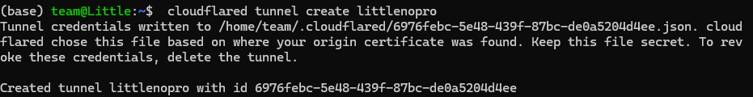


Tiếp theo, tạo file cấu hình `~/.cloudflared/config.yml`:

```bash
nano ~/.cloudflared/config.yml
```

Nội dung file:

```yaml
tunnel: 6976febc-5e48-439f-87bc-de0a5204d4ee
credentials-file: /home/team/.cloudflared/6976febc-5e48-439f-87bc-de0a5204d4ee.json

ingress:
  - hostname: littlenopro.io.vn
    service: http://127.0.0.1:80
  - hostname: www.littlenopro.io.vn
    service: http://127.0.0.1:80
  - hostname: littlenopro.id.vn
    service: http://127.0.0.1:80
  - hostname: www.littlenopro.id.vn
    service: http://127.0.0.1:80
  - service: http_status:404
```

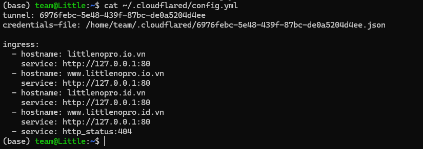

Đến đây ta sẽ tạo **DNS Record** thủ công trên Dashboard của Cloudflare (phần `content` sẽ là `6976febc-5e48-439f-87bc-de0a5204d4ee.cfargotunnel.com`):

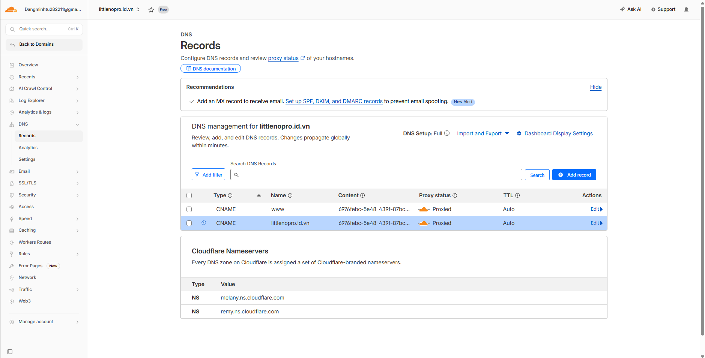
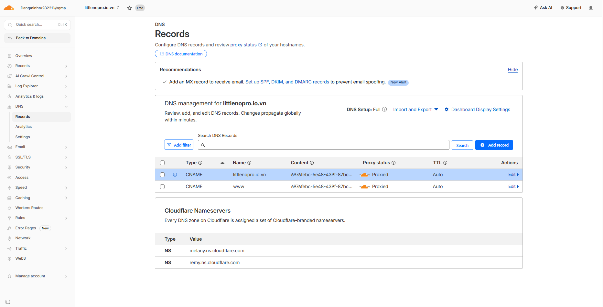

Chạy lệnh:
```bash
cloudflared tunnel run littlenopro
```

Sau đó truy cập vào từng domain trên browser để kiểm tra:

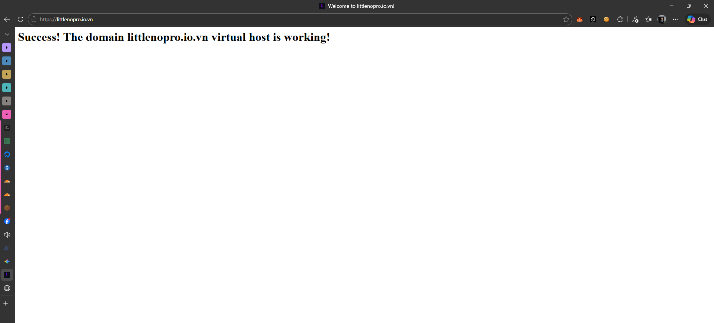
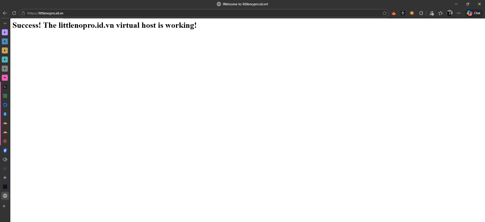

Vậy là ta đã public web server Apache từ máy mình ra Internet sử dụng "tunnel" của Cloudflare.

Ta có thể kiểm trang status của tunnel trên dashboard của Cloudflare:

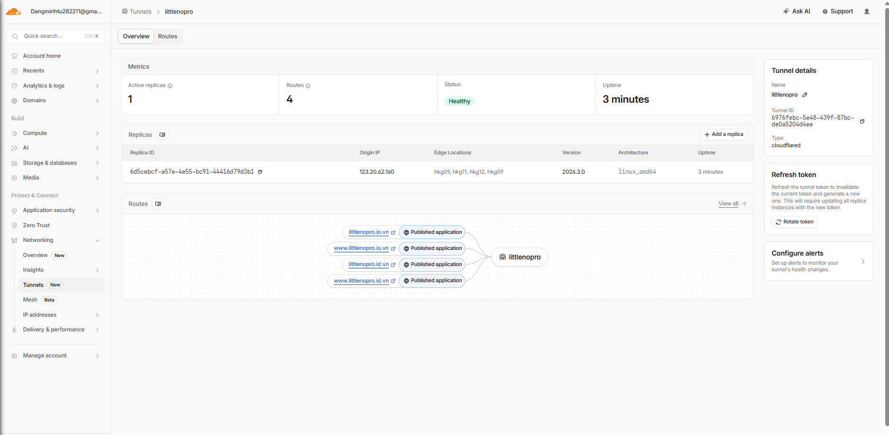
