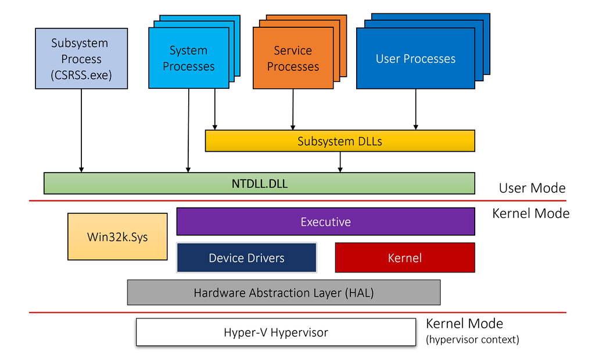

**Windows** được thiết kế theo kiểu phân tầng. Với người dùng cuối, nó chỉ là một hộp đen: bấm icon, chương trình chạy. Nhưng khi ta viết phần mềm, phân tích mã độc hay debug một hệ thống đang "treo", việc hiểu bên dưới có gì trở thành bắt buộc. Bài viết này mình sẽ nói về kiến trúc Windows: bắt đầu từ ranh giới **user mode / kernel mode**, đi qua các thành phần cốt lõi, **process** và **thread**, rồi kết thúc ở những tầng giao diện lập trình mà ứng dụng dùng để nói chuyện với kernel.

## Kernel mode and User mode

Điểm quan trọng nhất cần nắm trước tiên: Windows chia code chạy trên CPU thành hai mức quyền (privilege level, hay còn gọi là ring level). Việc chia mức này quyết định đoạn code được phép làm gì và truy cập tài nguyên nào.

- **User mode**: nơi mọi ứng dụng thông thường chạy. Code ở đây bị giới hạn quyền truy cập bộ nhớ và tập lệnh CPU.
- **Kernel mode**: nơi các thành phần hệ điều hành — dịch vụ hệ thống, driver thiết bị — hoạt động. Code kernel mode nắm toàn bộ bộ nhớ hệ thống và mọi lệnh mà CPU hỗ trợ.

Kiến trúc CPU nào cũng có cách gọi riêng cho mức quyền này: *code privilege level*, *ring level*, *supervisor mode* hay *application mode*. Tên gọi không quan trọng; điểm cốt lõi là kernel phải chạy ở mức đặc quyền cao hơn ứng dụng. Đây là nền tảng để hệ điều hành đảm bảo một ứng dụng lỗi không thể kéo cả hệ thống sập theo.

Vì sao Windows chỉ dùng đúng hai mức thay vì tận dụng bốn ring của x86? Vì những kiến trúc như ARM ngày nay, hay MIPS/Alpha trước đây, chỉ hỗ trợ hai mức đặc quyền. Chọn ngưỡng thấp nhất chung cho mọi nền tảng giúp kiến trúc gọn hơn và dễ port hơn, trong khi các ring trung gian của x86/x64 vốn không mang lại đảm bảo tương đương cho ranh giới ring 0 / ring 3.

## Overview Architecture

Windows chia thành hai mode chính như trên. Sơ đồ dưới đây là hình dung chuẩn về tương quan giữa chúng; các tầng trên là *user mode*, phần dưới là *kernel mode*, và mọi tương tác giữa hai bên đều đi qua một ranh giới được định nghĩa rõ ràng.

### User mode

*User mode* là môi trường hạn chế quyền, nơi phần lớn ứng dụng thực thi. Mỗi chương trình có một không gian địa chỉ riêng, tách biệt với các chương trình khác, nên nó không thể ghi thẳng vào tài nguyên hệ thống hay can thiệp vào process khác.

**Applications.** Đây là những chương trình người dùng trực tiếp tương tác: trình duyệt, soạn thảo văn bản, game. Mỗi process chạy trong **virtual address space** của riêng nó.

**Subsystems.** Tầng này làm cầu nối giữa ứng dụng user mode và các dịch vụ kernel mode:

- **Win32 Subsystem (`csrss.exe`)**: quản lý cửa sổ, đồ họa và sự kiện nhập liệu. Đây là subsystem chính của hầu hết ứng dụng desktop.
- **NT Subsystem (`ntdll.dll`)**: cung cấp giao diện giữa ứng dụng user mode và kernel. Nó chứa các **system call stub** — đoạn code chuẩn bị tham số rồi chuyển quyền thực thi sang kernel mode.
- **Các subsystem khác**: Windows từng hỗ trợ POSIX subsystem cho mục đích tương thích, dù ngày nay gần như không còn dùng đến.

Các subsystem nói trên đều được cài đặt trong file `.dll`. Một **Dynamic Link Library (DLL)** là file chứa code và dữ liệu dùng chung cho nhiều chương trình cùng lúc.

Ý tưởng ở đây khá đơn giản: thay vì biên dịch những hàm dùng chung — tạo cửa sổ, mở file — vào từng ứng dụng, Windows đặt chúng vào DLL. Khi cần, ứng dụng nạp DLL vào address space của mình lúc runtime. Lợi ích rõ nhất là tiết kiệm bộ nhớ: nếu 10 chương trình cùng dùng `kernel32.dll`, Windows chỉ giữ một bản code của DLL đó trong RAM vật lý và chia sẻ cho cả 10 process.

### Kernel mode

*Kernel mode* là mức thực thi đặc quyền, nơi đặt các thành phần lõi của hệ điều hành. Nó truy cập trực tiếp phần cứng và bộ nhớ, đồng thời chịu trách nhiệm quản lý tài nguyên, thực thi chính sách bảo mật và phục vụ user mode.

**Executive.** Lõi của Windows kernel, chứa các dịch vụ nền tảng:

- **Object Manager**: quản lý mọi tài nguyên hệ thống dưới dạng object, mang lại cách truy cập và kiểm soát thống nhất. File, process, thread, synchronization primitive đều là object.
- **Virtual Memory Manager (VMM)**: quản lý virtual memory, cấp cho mỗi process một address space riêng tư. Nó lo việc cấp phát, phân trang và bảo vệ bộ nhớ.
- **Process Manager**: tạo, quản lý và kết thúc process cùng thread.
- **Security Reference Monitor (SRM)**: thực thi chính sách bảo mật và kiểm soát truy cập, xác định process có đủ quyền truy cập một object hay không.
- **I/O Manager**: xử lý mọi thao tác vào/ra, cung cấp giao diện thống nhất cho driver thiết bị.
- **Cache Manager**: tăng hiệu năng bằng cách cache dữ liệu hay được truy cập trong bộ nhớ.
- **Plug and Play (PnP) Manager**: phát hiện và cấu hình thiết bị phần cứng.
- **Power Manager**: quản lý mức tiêu thụ điện năng của hệ thống.

**Kernel.** Tầng thấp nhất của kernel mode, đảm nhiệm các chức năng cơ bản: lập lịch thread, xử lý interrupt và dispatch exception. Executive được xây dựng trên nền tảng này.

**Device Drivers.** Thành phần phần mềm cho phép hệ điều hành giao tiếp với phần cứng. Chúng chạy ở kernel mode và có nhiệm vụ dịch yêu cầu I/O chung thành lệnh đặc thù cho từng thiết bị.

**Hardware Abstraction Layer (HAL).** Lớp trừu tượng giữa kernel và phần cứng bên dưới, cho phép Windows chạy trên nhiều nền tảng phần cứng khác nhau mà không phải sửa kernel.

Có một đặc điểm dễ bỏ qua nhưng rất quan trọng: vùng nhớ của kernel mode không gắn với từng process. Suy cho cùng, chỉ có một kernel và một bộ driver phục vụ tất cả process. "System space" này là nơi kernel, HAL và toàn bộ driver thường trú sau khi được nạp. Cách tổ chức đó vừa tự động chặn truy cập trực tiếp từ user mode, vừa khiến mọi thành phần kernel có ảnh hưởng trên toàn hệ thống — một memory leak trong driver sẽ không được thu hồi cho tới khi reboot. Ngược lại, user-mode process không thể leak thứ gì vượt quá vòng đời của chính nó, vì kernel chịu trách nhiệm đóng mọi handle và giải phóng bộ nhớ riêng khi process kết thúc.

Hệ thống phân cấp ở trên là rõ ràng: các thành phần Executive chạy ở kernel mode, cung cấp những dịch vụ nền móng như quản lý object và bộ nhớ; ứng dụng user mode cùng subsystem nằm phía trên và tương tác với kernel qua ranh giới đã định.

Trên các phiên bản Windows hiện đại còn tồn tại một tầng kiến trúc nằm *dưới* cả kernel, đóng vai trò ranh giới tin cậy cho toàn hệ thống: **hypervisor**.

### Hypervisor layer

Tầng này chỉ gồm một thành phần duy nhất là *hypervisor*, không có driver hay module nào khác trong môi trường đó. Bên trong nó là nhiều tầng và dịch vụ nội bộ: memory manager riêng, virtual processor scheduler, quản lý interrupt và timer, các routine đồng bộ, quản lý partition (instance máy ảo) và giao tiếp giữa các partition (IPC).

## System calls

Ứng dụng user mode không được truy cập thẳng tài nguyên kernel mode. Muốn nhờ kernel làm việc gì, nó phải dùng **system call** (hay *syscall*, *service call*). Luồng đi của một syscall gồm bốn bước:

1. Ứng dụng gọi một hàm trong DLL — thường là hàm bậc cao trong `kernel32.dll`. Hàm này tiếp tục gọi hàm nội bộ tương ứng trong `ntdll.dll` để chuẩn bị chuyển sang kernel.
2. Hàm trong `ntdll.dll` chuẩn bị tham số rồi thực thi một lệnh đặc biệt (`SYSENTER` hoặc `SYSCALL`) để chuyển CPU sang kernel mode.
3. Kernel nhận syscall, kiểm tra tham số và thực hiện thao tác được yêu cầu.
4. Kết quả được trả về ứng dụng, và thực thi tiếp tục ở user mode.

## Object and Handle

Windows dùng kiến trúc hướng object: mọi tài nguyên hệ thống đều được biểu diễn dưới dạng object. Mỗi object có type, attribute và method, mang lại cách quản lý tài nguyên thống nhất và an toàn.

- **Object type**: file, process, thread, mutex, semaphore, event,...
- **Object handle**: ứng dụng user mode truy cập object qua handle — định danh mờ, chỉ có ý nghĩa trong process sở hữu nó.
- **Access control**: SRM dùng Access Control List (ACL) để xác định user hoặc group nào được truy cập object nào và được phép làm gì.

Một **object** là cấu trúc dữ liệu đại diện cho một tài nguyên hệ thống như file, thread hay graphic image. Ứng dụng không đọc trực tiếp dữ liệu bên trong object, cũng không chạm được vào tài nguyên mà object ấy đại diện. Nó phải lấy **handle**, rồi dùng handle để thao tác với tài nguyên. Mỗi handle có một entry trong bảng do kernel quản lý nội bộ; entry đó chứa địa chỉ tài nguyên và thông tin nhận diện type.

Xét kỹ hơn, kernel object là một instance runtime của một object type tĩnh. Bản thân object type gồm: kiểu dữ liệu hệ thống định nghĩa, tập hàm thao tác trên instance của kiểu đó, và tập thuộc tính của object. Ba hệ quả kéo theo:

- Code kernel có thể dùng con trỏ trực tiếp tới object.
- Code user mode chỉ có thể lấy handle.
- Object được đếm tham chiếu (reference counted).

Khác biệt cốt lõi giữa object và một cấu trúc dữ liệu thường nằm ở tính đóng kín: nội dung bên trong object là opaque. Muốn đọc hay ghi dữ liệu, ta buộc phải gọi object service. Không thể sửa trực tiếp dữ liệu bên trong object. Chính sự tách biệt này cho phép thay đổi cài đặt bên dưới mà không đụng tới code sử dụng nó — một kỹ thuật rất đáng giá khi hệ thống sống hàng chục năm.

Tuy vậy, không phải mọi cấu trúc dữ liệu trong Windows đều là object. Chỉ dữ liệu cần được chia sẻ, bảo vệ, đặt tên hoặc công khai cho user mode (qua system service) mới được đóng gói thành object. Những cấu trúc chỉ phục vụ nội bộ một thành phần của hệ điều hành thì không.

## Process

Một **program** là chuỗi lệnh tĩnh; một **process** là vùng chứa tập hợp tài nguyên dùng khi thực thi instance của program đó.

Nói cách khác, process bằng program *cộng* với **execution context**. Execution context bao gồm trạng thái của processor (giá trị program counter và toàn bộ thanh ghi) lẫn memory map của process — bản đồ xác định các vùng bộ nhớ đã được cấp cho nó.

Memory map của một process gồm:

- **Text**: mã máy, tức chương trình đã biên dịch.
- **Data**: dữ liệu tĩnh và biến toàn cục đã khởi tạo.
- **Bss**: dữ liệu tĩnh chưa khởi tạo (chuỗi, số, cấu trúc toàn cục). Kích thước vùng này nằm trong bản thân chương trình.
- **Heap**: bộ nhớ cấp phát động, lấy qua các yêu cầu như `malloc` hay `new`.
- **Stack**: call stack, chứa return address, biến cục bộ, dữ liệu tạm và các thanh ghi được lưu.

*Process* là object quản lý và bao chứa một instance đang chạy của chương trình. *Thread* mới là thứ thực thi code và thực sự chạy. Ở góc nhìn tổng quan, một process sở hữu:

- Một chương trình thực thi, chứa code và dữ liệu khởi tạo để chạy bên trong process. Điều này đúng với hầu hết process, song một số process đặc biệt không có executable image vì được kernel tạo trực tiếp.
- Một virtual address space riêng tư, dùng để cấp phát bộ nhớ cho mọi nhu cầu của code trong process.
- Một **access token** (primary token), lưu security context của process. Thread chạy trong process dùng token này, trừ khi nó mượn token khác bằng **impersonation**. Mọi kiểm tra truy cập mặc định đều dựa trên token này.
- Một handle table riêng trỏ tới các executive object như event, semaphore, file.
- Một hoặc nhiều thread thực thi. Process user mode thông thường được tạo với một thread duy nhất, chạy hàm `main`/`WinMain` quen thuộc. Process không có thread gần như vô dụng và trong điều kiện bình thường sẽ bị kernel hủy.

## Thread

Thực thể trực tiếp thực thi code là *thread*. Thread nằm trong một process và dùng tài nguyên mà process cung cấp — virtual memory, handle tới kernel object — để làm việc.

Thông tin quan trọng của một thread:

- Access mode hiện tại: user hay kernel.
- Execution context, gồm thanh ghi processor và trạng thái thực thi.
- Một hoặc hai stack, phục vụ cấp phát biến cục bộ và quản lý lời gọi hàm.
- Mảng Thread Local Storage (TLS), cho phép lưu dữ liệu riêng của thread với cách truy cập thống nhất.
- Base priority và current (dynamic) priority.
- Processor affinity, cho biết thread được phép chạy trên những processor nào.

Ba trạng thái thường gặp nhất:

- **Running** — đang thực thi code trên một logical processor.
- **Ready** — chờ được lập lịch vì mọi processor liên quan đều đang bận hoặc không sẵn sàng.
- **Waiting** — chờ một sự kiện nào đó xảy ra mới đi tiếp. Khi sự kiện đến, thread chuyển sang Ready.

> Một thread luôn có ít nhất một stack nằm trong system (kernel) space, và stack này khá nhỏ — mặc định 12 KB trên hệ 32-bit, 24 KB trên hệ 64-bit. Thread user mode có thêm stack thứ hai trong user-space address range, lớn hơn đáng kể: mặc định có thể tăng tới 1 MB.

## Virtual memory

Mỗi process có một virtual, private, linear address space riêng. Ban đầu không gian này gần như trống — executable image và `ntdll.dll` là những thứ được map đầu tiên, sau đó tới các subsystem DLL. Khi thread chính bắt đầu chạy, bộ nhớ dần được cấp phát và nhiều DLL khác được nạp.

Địa chỉ bắt đầu từ 0 (thực tế 64 KB đầu và cuối không thể commit) và kéo tới mức tối đa phụ thuộc vào độ "bitness" của process và của hệ điều hành (32 hay 64-bit).

Hai đặc điểm cần nhớ:

- **Địa chỉ mang tính tương đối.** Vì mỗi process có address space riêng, khi xét địa chỉ `0x20000`, bản thân địa chỉ không đủ để kết luận. Phải nói rõ nó thuộc process nào.
- **Bộ nhớ là ảo.** Tồn tại quan hệ gián tiếp giữa dải địa chỉ và vị trí thật trong RAM vật lý. Từ góc nhìn thực thi, không cần biết vùng sắp truy cập có nằm trong RAM hay không. Nếu có, CPU đọc trực tiếp. Nếu không (được đánh dấu bằng một flag trong translation table entry), CPU ném ra page fault exception; page fault handler của memory manager sẽ lấy dữ liệu từ file thích hợp, copy vào RAM, cập nhật page table entry và yêu cầu CPU thử lại.

> Một buffer trong process có thể được map tới bộ nhớ vật lý, hoặc tạm thời nằm trong một file — chẳng hạn page file.

### States of page

- **Free** — page chưa được cấp phát, không có gì ở đó. Mọi truy cập vào page này sẽ gây access violation exception. Phần lớn page trong process mới tạo đều ở trạng thái Free.
- **Committed** — ngược với Free: page đã cấp phát và truy cập được, miễn là không vi phạm thuộc tính bảo vệ (ví dụ ghi vào page chỉ đọc sẽ gây access violation). Page committed thường được map tới RAM hoặc tới một file như page file.
- **Reserved** — page chưa commit, nhưng dải địa chỉ đã được giữ chỗ cho việc commit về sau. Từ phía CPU, nó giống hệt Free: mọi truy cập đều gây access violation. Điểm khác biệt: lời gọi `VirtualAlloc` (hay `NtAllocateVirtualMemory`) không chỉ định địa chỉ cụ thể sẽ không cấp phát vào vùng đã reserved.

## Application Programming Interface

Để lập trình viên tương tác với object và dịch vụ hệ điều hành, Windows cung cấp nhiều tầng API. Các tầng này phát triển qua nhiều thập kỷ, phản ánh sự thay đổi của mô hình lập trình và nhu cầu về kiến trúc hướng component. Khởi đầu là API kiểu C.

### Windows API

**Windows API** là giao diện lập trình hệ thống ở user mode của họ hệ điều hành Windows. Cụm **Win32 API** dùng để chỉ chung cả giao diện 32-bit lẫn 64-bit của Windows — đây là điểm nhiều người hay nhầm.

### Component Object Model (COM)

Để giải quyết hạn chế của API kiểu C, Microsoft giới thiệu **Component Object Model (COM)** năm 1993. Ban đầu COM ra đời để các ứng dụng Office chia sẻ dữ liệu — hình dung việc nhúng một biểu đồ Excel vào tài liệu Word. Khả năng này gọi là **Object Linking and Embedding (OLE)**, trước đó dựa trên cơ chế **Dynamic Data Exchange (DDE)**. Chính những hạn chế của DDE thúc đẩy việc tạo ra COM; phiên bản đầu tiên được phát hành dưới tên **OLE 2**.

COM đứng trên hai nguyên tắc:

- **Interface**: ứng dụng client tương tác với COM object (đôi khi gọi là COM server) qua những hợp đồng được định nghĩa rõ ràng. Interface nhóm các hàm liên quan và tạo ra chuẩn tương thích ở mức nhị phân, tránh vấn đề name mangling đặc thù của từng compiler — tức việc compiler mã hóa tên hàm kèm thông tin tham số theo cách không giống nhau giữa các compiler. Nhờ đó, nhà phát triển dùng được COM object từ nhiều ngôn ngữ: C, C++, Visual Basic, .NET.
- **Dynamic loading**: thay vì link tĩnh vào ứng dụng client, component COM được nạp động lúc runtime, thường nằm trong DLL hoặc file EXE.

COM còn mang tới những cơ chế quan trọng cho bảo mật, truyền dữ liệu giữa các process (marshalling) và mô hình threading. Nhiều công nghệ Windows quen thuộc — DirectX, Windows Media Foundation, Windows Shell — đều xây trên COM.

### Windows Runtime (WinRT)

Cùng với Windows 8, Microsoft ra mắt API và môi trường runtime mới mang tên **Windows Runtime (WinRT)**. Cần phân biệt rõ **WinRT** với **Windows RT** — phiên bản Windows cho thiết bị ARM đã bị khai tử.

WinRT được thiết kế làm nền tảng cho một lớp ứng dụng mới, ban đầu gọi là Metro App, nay là **Universal Windows Platform (UWP)**. Những ứng dụng này nhắm chạy trên nhiều loại thiết bị: IoT, điện thoại, tablet, desktop, thậm chí cả Xbox và HoloLens.

Về mặt kỹ thuật, WinRT xây trên COM và mở rộng hạ tầng lõi của nó. Nó bổ sung metadata kiểu dữ liệu đầy đủ lưu trong file `.winmd` — phiên bản cải tiến của khái niệm type library trong COM. Kết quả là một API nhất quán hơn, với hệ thống namespace phân cấp rõ ràng.

Điều quan trọng: WinRT **không** thay thế hoàn toàn Windows API truyền thống mà tồn tại song song. Ứng dụng desktop có thể dùng một phần API của WinRT; ngược lại, ứng dụng UWP dùng được một tập hạn chế các API Win32 và COM cổ điển. Xét đến cùng, WinRT vẫn dựa trên các binary và API cũ của Windows.

Để lập trình viên dễ dùng WinRT, Microsoft cung cấp "language projection" cho nhiều ngôn ngữ: C++, C#, JavaScript. Với C++, có C++/CX (tập mở rộng ngôn ngữ) và C++/WinRT hiện đại, chuẩn hơn. Với các ngôn ngữ .NET, tầng COM interop sẵn có cho phép truy cập WinRT liền mạch. Lập trình viên JavaScript dùng WinJS để tương tác với WinRT, lấy HTML làm giao diện ứng dụng.

### .NET Framework

.NET Framework là phần tích hợp trong hệ điều hành Windows, gồm hai thành phần:

- **Common Language Runtime (CLR)**: engine thực thi của ứng dụng .NET, một máy ảo quản lý cấp phát bộ nhớ (qua garbage collector), bảo mật và thread. Code chạy trong CLR gọi là **managed code**. Bản thân CLR được cài đặt như một COM server.
- **Framework Class Library (FCL)**: tập hợp đồ sộ các type viết sẵn để lập trình viên dựng ứng dụng, trải từ thành phần giao diện, khả năng mạng tới truy cập cơ sở dữ liệu.

Ra mắt năm 2002, .NET Framework hướng tới tăng năng suất lập trình viên và cải thiện độ an toàn, độ tin cậy của ứng dụng. Nó hỗ trợ nhiều ngôn ngữ, nổi bật nhất là C# và Visual Basic. Bản .NET Framework gốc chỉ chạy trên Windows; người kế nhiệm mã nguồn mở, đa nền tảng mang tên **.NET** (trước là .NET Core) cho phép phát triển trên Windows, macOS và Linux. .NET Framework vẫn là một phần của Windows, nhưng mọi phát triển mới được khuyến khích chuyển sang nền tảng .NET hiện đại.

## File System

Những thành phần kiến trúc ở trên không phải khái niệm trừu tượng. Chúng được cài đặt trong một tập file cụ thể trên đĩa hệ thống. Hiểu các file này giúp nối lý thuyết với thực tế. Sửa đổi hay xóa nhầm chúng đều có thể khiến hệ thống mất ổn định hoặc hỏng hẳn.

### C:\Windows

Windows phụ thuộc vào rất nhiều file để hoạt động, nằm rải rác ở nhiều thư mục. Trong đó, một số file "cốt lõi" là bắt buộc cho quá trình boot, chạy kernel, quản lý phần cứng và cung cấp dịch vụ hệ thống cơ bản:

- **`ntoskrnl.exe` (NT Operating System Kernel)**: trái tim của Windows. File này chứa kernel — bộ phận quản lý tài nguyên hệ thống gồm bộ nhớ, process và thread — cùng executive, tức tập dịch vụ mà kernel và các thành phần khác sử dụng.
- **`hal.dll` (Hardware Abstraction Layer)**: lớp trừu tượng giữa hệ điều hành và phần cứng, cho phép Windows chạy trên nhiều nền tảng khác nhau mà không phải sửa kernel. Nó dịch lệnh chung của hệ điều hành thành lệnh đặc thù cho phần cứng.
- **`ntdll.dll` (NT Layer DLL)**: giao diện giữa ứng dụng user mode và kernel. Nó chứa các system call (còn gọi là NT API) mà ứng dụng dùng để nhờ kernel tạo process, cấp phát bộ nhớ hay truy cập file.
- **`kernel32.dll` (Windows Kernel API Client DLL)**: cung cấp tập con Windows API được hầu hết ứng dụng user mode dùng, gồm hàm quản lý process, thread, bộ nhớ và tài nguyên hệ thống. Nó đóng vai cầu nối giữa ứng dụng và `ntdll.dll`.
- **`user32.dll` (Windows User API Client DLL)**: các hàm quản lý giao diện người dùng — tạo cửa sổ, xử lý message, vẽ đồ họa.
- **`gdi32.dll` (Windows Graphics Device Interface API Client DLL)**: các hàm vẽ đồ họa lên màn hình, dùng để tạo và hiển thị cửa sổ, vẽ đường và hình, render text.
- **`advapi32.dll` (Advanced Windows 32 Base API Client DLL)**: nhóm hàm nâng cao cho bảo mật, registry và service.
- **`msvcrt.dll` (Microsoft Visual C++ Runtime Library)**: runtime của compiler Microsoft Visual C++, cung cấp hàm quản lý bộ nhớ, xử lý chuỗi và nhiều tác vụ thông dụng. Rất nhiều ứng dụng phụ thuộc vào DLL này.
- **`winload.exe` (Windows Boot Loader)**: nạp kernel vào bộ nhớ trong quá trình boot. File này do Windows Boot Manager gọi.
- **`winresume.exe` (Windows Resume Loader)**: phục hồi Windows từ trạng thái hibernation. Nó nạp nội dung của hibernation file vào bộ nhớ và khôi phục hệ thống về trạng thái trước đó.
- **`bootmgr` (Windows Boot Manager)**: hiển thị boot menu và nạp hệ điều hành. File này nằm ở thư mục gốc của ổ hệ thống.
- **`BCD` (Boot Configuration Data)**: chứa dữ liệu cấu hình boot — danh sách hệ điều hành đã cài và các tùy chọn khởi động. Nó thay thế file `boot.ini` của các phiên bản Windows cũ.

Bên cạnh đó là những process nền tảng, thuộc nhóm user-mode process đầu tiên được khởi chạy trong trình tự boot để đưa hệ thống tới trạng thái dùng được:

- **`smss.exe` (Session Manager Subsystem)**: tạo user session, khởi chạy Windows subsystem (`csrss.exe`) và tiến trình logon (`winlogon.exe`).
- **`csrss.exe` (Client Server Runtime Subsystem)**: subsystem user mode quản lý console của Windows và hỗ trợ ứng dụng Win32.
- **`wininit.exe` (Windows Initialization Process)**: khởi tạo môi trường Windows, gồm việc chạy service và tạo user profile.
- **`services.exe` (Service Control Manager)**: quản lý Windows service — khởi động, dừng và giám sát.
- **`lsass.exe` (Local Security Authority Subsystem Service)**: thực thi chính sách bảo mật của hệ thống, xác thực người dùng và quản lý truy cập tài nguyên.

Nhóm file kernel chính có thể tóm gọn như sau:

| File | Thành phần |
| --- | --- |
| `Ntoskrnl.exe` | Executive và Kernel |
| `Hal.dll` | HAL |
| `Win32k.sys` | Phần kernel mode của GUI |
| `*.sys` trong `\SystemRoot\System32\Drivers` | Các file driver cốt lõi |

## Conclusion

Trên đây là tổng hợp những gì mình biết về kiến trúc thực sự của Windows. Điểm cần nhớ nhất là sự phân chia giữa **kernel mode** đặc quyền và **user mode** hạn chế — thiết kế mang tính sống còn với bảo mật và độ ổn định của hệ thống. Kernel quản lý tài nguyên lõi dưới dạng **object**, còn **process** và **thread** mới là thứ thao tác trên chúng. Ứng dụng user mode làm việc với các thành phần này qua một ranh giới rõ ràng bằng **system call**, và các syscall ấy được phơi ra qua nhiều tầng API: từ Win32 API cổ điển cho tới .NET Framework hiện đại.
